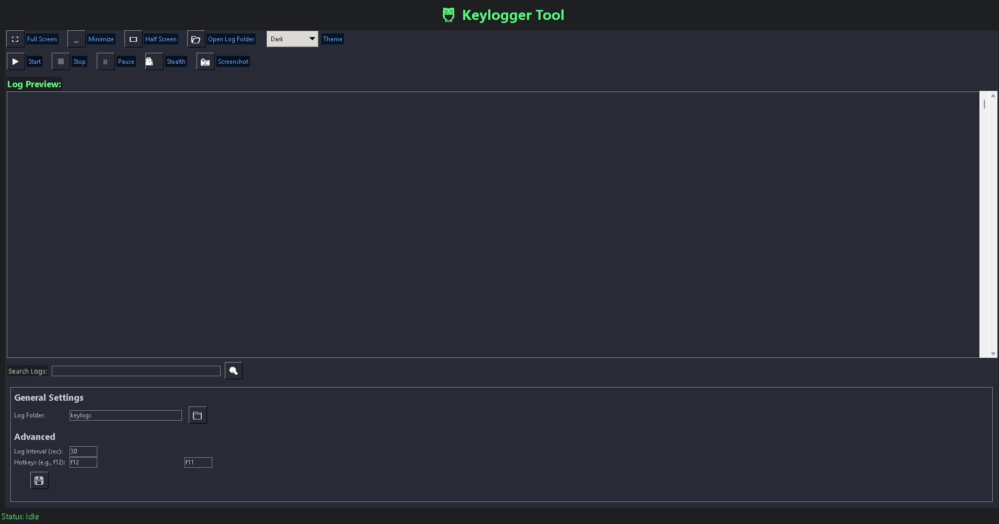
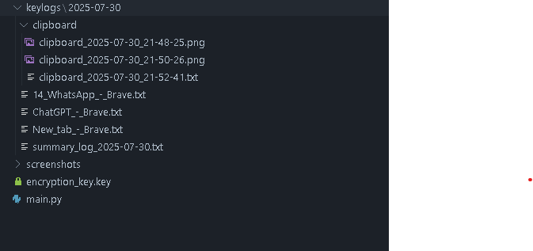
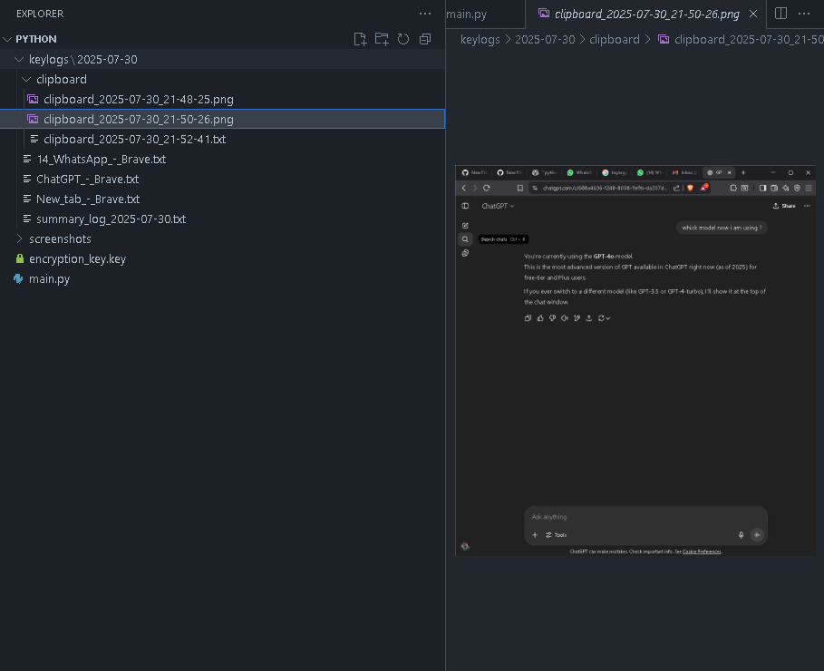
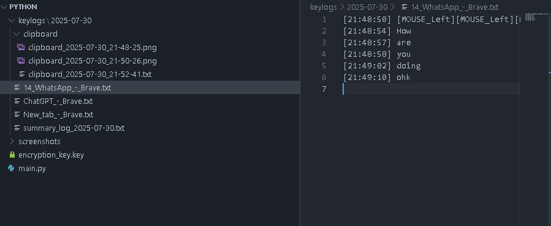
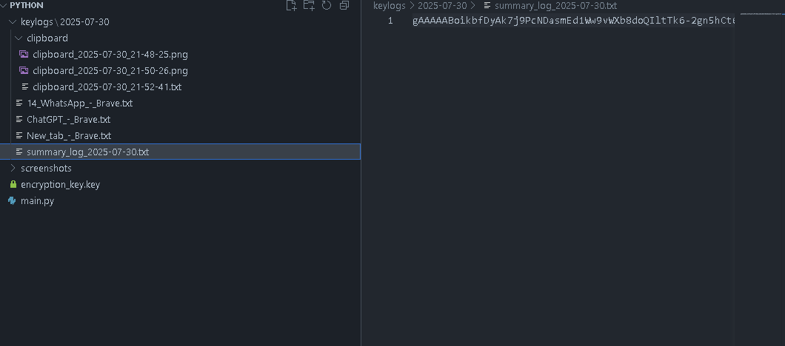
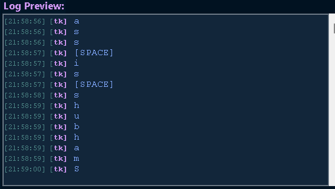
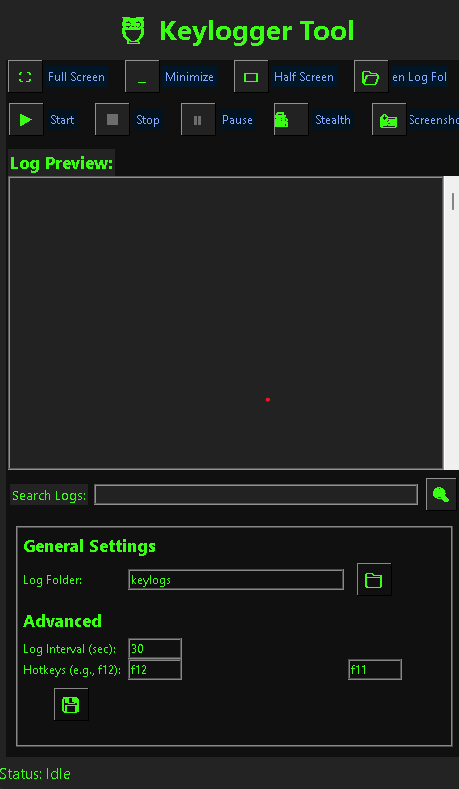

<h1 align="center">🦉 Keylogger Tool V12</h1>

<p align="center">
  
  
  
  
  
  
  
  
  
  
  
  
  
  
</p>

---

<details>
<summary>⚡ <b>Quick Install</b> <i>(click)</i></summary>

```bash
git clone https://github.com/shubham-shipt/keylog-v6.git
cd keylog-v6
```
```
# Install all required libraries
pip install pynput pillow cryptography pygame pyperclip tk
```
```
# (Or, for all dependencies at once)
pip install -r requirements.txt
```
```
# Run the script
python keylogger_v12.py
```
</details>
<details>
<summary>🔎 <b>Info & Usage</b> <i>(click)</i></summary>

- **Category:** <span style="color:#FF5E57"><b>Advanced Monitoring Tool</b></span>
- **WhatsApp/Facebook/Discord/Telegram Chat Logging**
- **Password & Credential Capture** (browsers, terminals, editors, etc.)
- **Clipboard Espionage** (text/images, passwords or secrets)
- **Platforms:** Windows (full), Linux/Mac (partial)
- **No cloud, no email alerts, 100% offline, encrypted logs**

</details>


<details>
<summary>🛡️ <b>How to Decrypt Fernet Encrypted </b> <i>(click)</i></summary>

```python
from cryptography.fernet import Fernet

# Replace with your key and token
key = b'YOUR_KEY_HERE'
token = b'YOUR_ENCRYPTED_STRING_HERE'

fernet = Fernet(key)
decrypted = fernet.decrypt(token)
print(decrypted.decode())
```

**How it works:**  
- Install the cryptography library:  
  `pip install cryptography`
- Paste your key and token into the script above.
- Run the script.  
- **The output will be printed in your terminal as plain text after decryption.**

</details>

<details>
<summary>📝 <b>Example Keylogger Output Summary</b> <i>(click to expand)</i></summary>

```text
───────────── KEYLOGGER SUMMARY ─────────────
Session Start: 2025-07-30 09:12:01
Session End  : 2025-07-30 14:45:17
Total Duration: 5 hours 33 mins

[🟢 WhatsApp]
 - 09:14:20 → 09:16:05
 - Typed: "Hey, are we meeting at 5pm? 👍"
 - Copied: "Location: Cafe Coffee Day"

[🔵 Telegram]
 - 09:20:40 → 09:23:12
 - Typed: "Sending the project files now."
 - Screenshot taken at 09:21:18

[🌐 Chrome]
 - 10:05:10 → 11:27:58
 - Typed: "github copilot documentation"
 - Copied: "https://github.com/features/copilot"
 - Mouse: 14 clicks, 6 scrolls
 - Screenshot taken at 10:10:44

[📝 Notepad]
 - 12:00:33 → 12:25:01
 - Typed: 
    "Todo:
    - Finish report
    - Email John
    - Backup files"
 - Clipboard: "Confidential: Salary.xlsx"

[🗂️ Explorer]
 - 13:55:09 → 14:07:44
 - Actions: 4 files renamed, 2 files deleted
 - Screenshot taken at 14:00:00

───────────── END OF SUMMARY ─────────────
```

</details>

---

## 🧩 Feature Grid

<div align="center" style="font-size:1.1em">

<b>🕵️ Stealth</b> <sub>Instant hide/show (F12)</sub>  
⬇️  
 <b>Clipboard</b> <sub>Logs text & images</sub>  
⬇️  
 <b>Screenshots</b> <sub>Manual capture</sub>  
⬇️  
 <b>Mouse</b> <sub>Click & scroll tracking</sub>  
⬇️  
 <b>Encrypted</b> <sub>Fernet encryption</sub>  
⬇️  
 <b>Themes</b> <sub>7+ dark/hacker themes</sub>  
⬇️  
 <b>AI Logs</b> <sub>Smart summaries</sub>  

</div>

---

## 🌌 Visual Gallery

<table align="center">
  <tr>
    <p align="center">
  
</p>
    <td align="center"><br><b> </b></td>
    <td align="center"><br><b>  </b></td>
    <td align="center"><br><b> </b></td>
  </tr>
  <tr>
    <td align="center"><br><b> </b></td>
    <td align="center"><br><b> </b></td>
    <td align="center"><br><b></b></td>
  </tr>
</table>

---

## 📦 Tech Stack

<div align="center">
  
  
  
  
  
  
</div>

**Core Language:**  
&nbsp;&nbsp;• Python 3.8+  

**Key Libraries:**  
- `pynput` <sub><i>(Keyboard/Mouse listening)</i></sub>
- `pillow` <sub><i>(Screenshots, image handling)</i></sub>
- `cryptography` <sub><i>(Fernet log encryption)</i></sub>
- `pygame` <sub><i>(Audio/notification features)</i></sub>
- `pyperclip` <sub><i>(Clipboard access)</i></sub>
- `tkinter` <sub><i>(Modern GUI frontend)</i></sub>

**Cross-Platform:**  
- 🟦 Windows <b>(full support)</b>  
- 🐧 Linux / 🍏 Mac <b>(partial support)</b>

---
> 🟢 **Manual Run:** Open the script, understand the code, and execute it as per your custom needs.

---

> ⚠️ **Legal Notice:**  
> This tool is for **educational purposes** only. Unauthorized use may be illegal or unethical.

---

<p align="center">
  <a href="https://github.com/shubham-shipt/keylog-v6">
    
  </a>
</p>
